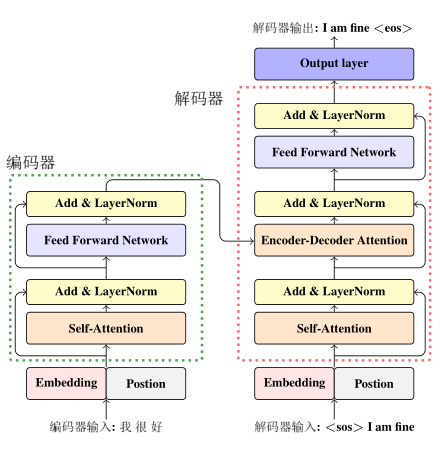
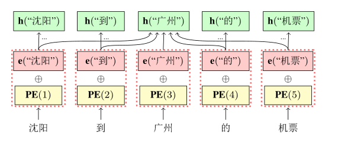
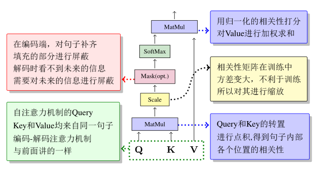
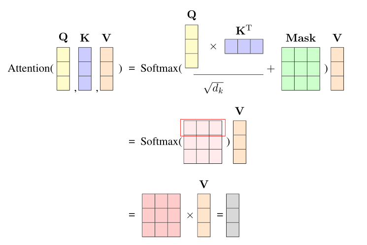
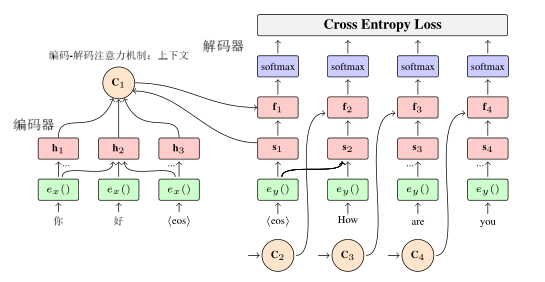
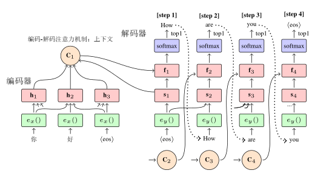

# NiuTensor张量计算库

## NiuTensor
NiuTensor是小牛开源项目所开发的一个轻量级工具包，提供了完整的张量定义及计算功能，可以被用于深度学习相关研究及工业系统的开发。NiuTensor具有以下特点：

* 简单小巧，易于修改
* C语言编写，代码高度优化
* 同时支持CPU和GPU设备
* 丰富的张量计算接口
* 支持C/C++调用方式

## 安装方法

NiuTensor工具包的安装方式为CMake（跨平台：支持Windows、Linux以及macOS），集成开发环境支持Visual Studio（Windows平台）以及CLion（Linux和macOS平台）。

NiuTensor工具包的第三方运算加速库支持：

* 所创建项目如在CPU上运行，我们的系统支持高性能的数学运算库，推荐安装[MKL](https://software.intel.com/en-us/mkl)或[OpenBLAS](http://www.openblas.net/)。
* 所创建项目如需在GPU上运行，需安装 [CUDA](https://developer.nvidia.com/cuda-downloads)，CUDA版本需求为9.2及以上，CUDA工具为创建高性能GPU加速应用程序提供了开发环境。

> 注意：
>
> 对于第三方运算库的支持中，由于MKL和OpenBLAS二者所实现的API互有重叠，因此不支持同时使用。

### 工具包的安装

NiuTensor工具包可以在Windows、Linux以及macOS环境下进行安装，支持生成可执行程序以及动态链接库两种目标，具体安装方法如下。

#### Windows

对于Windows平台下NiuTensor工具包的使用，这里推荐通过Visual Studio集成开发环境对项目进行管理，项目配置使用CMake自动生成。

##### CMake方式（Visual Studio）

对于WIndows平台的NiuTensor工具包安装，这里可以使用CMake工具自动生成Visual Studio项目（需要用户提前安装CMake工具以及Visual Studio集成开发环境），操作步骤如下：

- 在工具包根目录新建目录以保存生成的Visual Studio项目文件（如建立build目录）。
- 在项目根目录打开Windows平台的命令行工具（如PowerShell），执行`cd build`命令进入新建的build目录。
- 执行CMake命令对Visual Studio项目进行生成（如果 visual studio 版本低于 2019，则在使用下列命令的时候需额外加上`-A x64`的CMake参数），如计划生成动态链接库，则仅需在命令中额外加上`-DGEN_DLL=ON`的CMake参数即可，否则默认生成可执行程序。
  - 如项目计划启用MKL数学运算库（需用户自行安装），则仅需在CMake命令中使用`-DUSE_MKL=ON`参数，并通过`-DINTEL_ROOT='/intel/root/path'`指定MKL库（Intel工具包）的安装路径。如`cmake -DUSE_MKL=ON -DINTEL_ROOT='C:/Program Files (x86)/IntelSWTools/compilers_and_libraries_2020.2.254/windows' ..`。
  - 如项目计划启用OpenBLAS数学运算库（需用户自行安装），则仅需在CMake命令中使用`-DUSE_OPENBLAS=ON`参数，并通过`-DOPENBLAS_ROOT='/openblas/root/path'`指定OpenBLAS库的安装路径。如`cmake -DUSE_OPENBLAS=ON -DOPENBLAS_ROOT='C:/Program Files/OpenBLAS' ..`。
  - 如项目计划启用CUDA数学运算库（需用户自行安装），则仅需在CMake命令中使用`-DUSE_CUDA=ON`参数，并通过`-DCUDA_ROOT='/cuda/root/path'`指定CUDA库的安装路径。如`cmake -DUSE_CUDA=ON -DCUDA_ROOT='C:/Program Files/NVIDIA GPU Computing Toolkit/CUDA/v9.2' ..`。如需在GPU设备上使用半精度浮点数进行运算，需在启用`-DUSE_CUDA=ON`参数的同时启用`-USE_HALF_PRECISION=ON`参数（需要注意的是半精度但需要注意的是，半精度操作仅在使用Pascal及更新架构的NVIDIA GPU中提供支持，该项可参考[NVIDIA GPU设备信息](https://developer.nvidia.com/cuda-gpus)进行查询）。
- 执行成功将显示`Build files have been written to:...`。
- 打开build目录中的NiuTensor.sln文件即可通过Visual Studio打开NiuTensor项目。
- 打开后在解决方案管理器中选中NiuTensor，右键将其设为启动项目即可开始使用。

> 注意：
>
> 动态链接库在编译结束后并不能直接运行，生成的库文件将保存在项目根目录的lib路径下，用户可根据自身需求将其嵌入到自己的项目中进行使用。

#### Linux和macOS

对于Linux和macOS平台下NiuTensor工具包的使用，这里提供两种使用方式进行项目管理，分别为基于CMake的CLion集成开发环境以及CMake工具（命令行）的方式，开发人员可任选其一。

##### CMake方式（CLion）

对于Linux或macOS平台的NiuTensor工具包安装，CLion集成开发环境可以通过对CMakeLists.txt文件进行解析自动获取项目信息（需要用户提前安装CMake工具以及CLion集成开发环境），操作步骤如下：

- 使用CLion打开NiuTensor项目所在目录（确保CMakeLists.txt在其根目录位置），CLion将根据CMakeLists.txt文件自动读取项目信息。
- 打开CLion首选项，点击“构建，执行，部署”选项卡中的CMake，在“CMake选项”中进行设置，设置完成后CLion将自动使用CMake对项目进行构建，如计划生成动态链接库，则仅需在在“CMake选项”中额外加上`-DGEN_DLL=ON`的CMake参数即可，否则默认生成可执行程序。
  - 如项目计划启用MKL数学运算库（需用户自行安装），则仅需在“CMake选项”中填入`-DUSE_MKL=ON`，并通过`-DINTEL_ROOT='/intel/root/path'`指定MKL库（Intel工具包）的安装路径。如`-DUSE_MKL=ON -DINTEL_ROOT='/opt/intel/compilers_and_libraries_2020.2.254/linux'`。
  - 如项目计划启用OpenBLAS数学运算库（需用户自行安装），则仅需在“CMake选项”中填入`-DUSE_OPENBLAS=ON`，并通过`-DOPENBLAS_ROOT='/openblas/root/path'`指定OpenBLAS库的安装路径。如`-DUSE_OPENBLAS=ON -DOPENBLAS_ROOT='/opt/OpenBLAS'`。
  - 如项目计划启用CUDA数学运算库（需用户自行安装），则仅需在“CMake选项”中填入`-DUSE_CUDA=ON`，并通过`-DCUDA_ROOT='/cuda/root/path'`指定CUDA库的安装路径。如`-DUSE_CUDA=ON -DCUDA_ROOT='/usr/local/cuda-9.2'`。如需在GPU设备上使用半精度浮点数进行运算，需在启用`-DUSE_CUDA=ON`参数的同时启用`-USE_HALF_PRECISION=ON`参数（需要注意的是半精度但需要注意的是，半精度操作仅在使用Pascal及更新架构的NVIDIA GPU中提供支持，该项可参考[NVIDIA GPU设备信息](https://developer.nvidia.com/cuda-gpus)进行查询）。

##### CMake方式（命令行）

若仅需通过命令行方式对项目进行管理，开发者同样可以使用CMake快速对NiuTensor项目进行编译安装（需要用户提前安装CMake工具），操作步骤如下：

- 在项目根目录打开Linux或macOS平台的命令行工具（如Terminal），在工具包内新建目录以保存生成的中间文件（如执行`mkdir build`建立build目录）。
- 执行`cd build`命令进入新建的build目录。
- 执行CMake命令对项目进行生成，如计划生成动态链接库，则仅需在命令中额外加上`-DGEN_DLL=ON`的CMake参数即可，否则默认生成可执行程序。
  - 如项目计划启用MKL数学运算库（需用户自行安装），则仅需在CMake命令中使用`-DUSE_MKL=ON`参数，并通过`-DINTEL_ROOT='/intel/root/path'`指定MKL库（Intel工具包）的安装路径。如`cmake -DUSE_MKL=ON -DINTEL_ROOT='/opt/intel/compilers_and_libraries_2020.2.254/linux' ..`。
  - 如项目计划启用OpenBLAS数学运算库（需用户自行安装），则仅需在CMake命令中使用`-DUSE_OPENBLAS=ON`参数，并通过`-DOPENBLAS_ROOT='/openblas/root/path'`指定OpenBLAS库的安装路径。如`cmake -DUSE_OPENBLAS=ON -DOPENBLAS_ROOT='/opt/OpenBLAS' ..`。
  - 如项目计划启用CUDA数学运算库（需用户自行安装），则仅需在CMake命令中使用`-DUSE_CUDA=ON`参数，并通过`-DCUDA_ROOT='/cuda/root/path'`指定CUDA库的安装路径。如`cmake -DUSE_CUDA=ON -DCUDA_ROOT='/usr/local/cuda-9.2' ..`。如需在GPU设备上使用半精度浮点数进行运算，需在启用`-DUSE_CUDA=ON`参数的同时启用`-USE_HALF_PRECISION=ON`参数（需要注意的是半精度但需要注意的是，半精度操作仅在使用Pascal及更新架构的NVIDIA GPU中提供支持，该项可参考[NVIDIA GPU设备信息](https://developer.nvidia.com/cuda-gpus)进行查询）。
- 执行成功将显示`Build files have been written to:...`并在该目录下生成Makefile文件。
- 执行`make -j`命令对NiuTensor项目进行编译，执行成功将显示`Built target NiuTensor`，安装完毕。

如编译目标为可执行程序，则在完成安装后将在bin目录下生成NiuTensor，如目标为动态链接库，则所生成的库文件将保存在项目根目录的lib路径下。

对于生成可执行程序的安装方式，在环境配置完成后，可以使用`NiuTensor -test`命令运行本项目的测试用例，如果最后输出

```shell
OK! Everything is good!
```

则说明本项目配置成功。

>注意：
>
>若先生成CPU上运行的可执行文件，之后如需生成GPU的可执行文件，需要先执行make clean命令，删除生成CPU时产生的中间结果，反之亦然。

### 将工具包嵌入到自己的项目中

若希望在自己的项目中使用NiuTensor工具包，这里建议将工具包编译为动态链接库进行使用，编译库的方式可以参考前文所述，而对于库文件的使用规则如下：

* 在所创建项目中需要引用XTensor.h、core里的CHeader.h和function里的FHeader.h这三个头文件：
  * 通过XTensor.h可以获取我们需要操作的XTensor类。
  * 通过core里的CHeader.h可以对Tensor进行一些张量运算。
  * 通过function里的FHeader.h可以调用一些激活函数。
* 在所创建项目中使用命名空间nts。

编译过程以单元测试以及样例程序为例（即编译NiuTensor库中的Main.cpp），假设动态链接库所在的路径为当前目录（项目根目录）的lib目录，则通过以下命令可以编译生成可执行文件：

```shell
g++ -o App ./source/Main.cpp -L./lib -lNiuTensor -std=c++11
```

然后将lib目录加入到环境变量中，可以通过以下命令进行临时修改（退出shell后则失效）：

```shell
export LD_LIBRARY_PATH=./lib:$LD_LIBRARY_PATH
```

或者将上述命令加入到~/.bashrc配置文件中进行永久修改（需要将相对路径./lib转换为绝对路径），并执行以下这条命令使修改立即生效：

```shell
source ~/.bashrc
```

之后就可以运行App可执行文件。

```shell
./App
```

## 什么是张量

在计算机科学中，张量（Tensor）通常被定义为$n$维空间中的一种量，它具有$n$个分量，这种张量本质上是一个多维数组（ multidimensional array）。张量的阶或秩是这个多维数组的维度，或者简单理解为索引张量里的每个元素所需要的索引个数。通常来说，0阶张量被定义为标量（Scalar），1阶张量被定义为向量（vector），而2阶张量被定义为矩阵（matrix）。比如，在一个三维空间中，1阶张量就是空间中点所表示的向量$(x,y,z)$，其中$x$、$y$、$z$分别表示这个点在三个轴上的坐标。

张量是一种高效的数学建模工具，它可以将复杂的问题通过统一、简洁的方式进行表达。比如，姜英俊同学做饭需要2斤牛肉、5斤土豆，市场上牛肉每斤32元、土豆每斤2元，那么购买这些食物总共花费$2 \times 32 + 5 \times 2 = 74$元。如果用张量来描述，我们可以用一个1阶张量$a=(2,5)$表示所需不同食物的重量。然后用另一个1阶张量$b=(32,2)$表示不同食物的价格。最后，我们用一个0阶张量$c$表示购买这些食物的总价，计算如下

$$
\begin{aligned}
  c & = a \times b^T \\
    & = \left(\begin{matrix}2 & 5\end{matrix}\right) \times \left(\begin{matrix}32 \\ 2\end{matrix}\right) \\
    & = 2 \times 32 + 5 \times 2 \\
    & = 74
\end{aligned}
$$

其中$b^T$表示行向量$b$的转置 - 列向量，$\times$表示向量的乘法。第二天，姜英俊同学换了一个市场，这里牛肉每斤35元、土豆每斤1元。如果要知道在两个市场分别购物的总价，可以把$b$重新定义为一个2阶张量$\left(\begin{matrix}32 & 2 \\ 35 & 1\end{matrix}\right)$，总价$c$定义为一个2阶张量。同样有

$$
\begin{aligned}
  c & = a \times b^T \\
    & = \left(\begin{matrix}2 & 5\end{matrix}\right) \times \left(\begin{matrix}32 & 35 \\ 2 & 1\end{matrix}\right) \\
    & = \left(\begin{matrix}74 & 75\end{matrix}\right)
\end{aligned}
$$

即，在两个市场分别花费74元和75元。可以看出，利用张量可以对多样、复杂的问题进行建模，比如，可以进一步扩展上述问题中$a$、$b$、$c$的定义，把它们定义成更高阶的张量，处理不同时间、不同市场、不同菜谱的情况，但是不论情况如何变化，都可以用同一个公式$c = a \times b^T$来描述问题。

许多现实世界的问题都可以被描述为张量表达式（expression），也就是把张量的组合、计算描述为算数表达式。这种建模方式也构成了现代神经网络模型及深度学习方法的基础。在许多机器学习工具中，张量计算已经成为了神经网络前向、反向传播等过程的基本单元，应用十分广泛。

## 如何定义张量

如果你是一名C/C++或者Python的使用者，那么在程序中使用NiuTensor定义张量将非常简单。首先，下载NiuTensor的工具包，并解压到任意目录，比如~/NiuTensor目录。我们会在NiuTensor这个目录中找到source子目录，它是存放源代码的目录。对于source子目录的结构，信息如下：

* ~/NiuTensor/source/tensor/XCall.h - 定义了张量结构XTensor，以及构建和销毁XTensor的接口
* ~/NiuTensor/source/tensor/core - 存放张量计算的函数声明及函数体实现的源文件
    * arithmetic - 存放有关算术运算的源文件
    * getandset - 存放有关数据存取的源文件
    * math - 存放有关数学运算的源文件
    * movement - 存放有关数据移动的源文件
    * reduce - 存放有关规约操作的源文件
    * shape - 存放有关形状转换的源文件
    * sort - 存放有关排序操作的源文件
* ~/NiuTensor/source/tensor/function - 存放各种激活函数的源文件
* ~/NiuTensor/source/tensor/loss - 存放各种损失函数的源文件
* ~/NiuTensor/source/tensor/test - 存放单元测试的源文件
* ~/NiuTensor/source/tensor/*.h(cpp) - 与张量定义不相关，后文介绍 :)

以C/C++为例，仅需要在源程序中引用XTensor.h头文件就可以完成张量的定义。下面是一个简单的示例程序sample.cpp
```cpp
#include "XTensor.h"          // 引用XTensor定义的头文件

using namespace nts;          // 使用XTensor所在的命名空间nts

int main(int argc, const char ** argv)
{
    // 声明一个张量tensor，它的类型是XTensor
    XTensor tensor;                         
    
    // 初始化这个维度为50列*100行的张量(2阶张量，数据类型为X_FLOAT)      
    InitTensor2D(&tensor, 50, 100, X_FLOAT);
    
    // 之后可以使用张量tensor了
    
    return 0;
}
```

下一步，编译以上源程序，这个过程需要指定XTensor.h头文件所在目录。比如，使用g++编译sample.cpp

```cpp
g++ sample.cpp -I~/NiuTensor/source/tensor -o sample
```

在sample.cpp中使用了XTensor，它是NiuTensor里的一个类，这个类定义了张量所需的数据结构，我们可以使用这个类轻松完成对张量的计算、拷贝等各种操作。XTensor类型的变量被声明后，还需要被初始化，或者说被真正指定为一个张量，比如，需要指定张量的各个维度、张量中每个单元的数据类型、给张量分配内存空间等。InitTensor2D就是一个张量初始化函数，它把张量初始化为一个矩阵，有四个参数：指向被初始化的张量的指针，矩阵的列数，矩阵的行数，数据单元的类型。这里X_FLOAT，是NiuTensor自定义的枚举类型，它表示单精度浮点数，我们也可以使用X_INT或X_DOUBLE，将数据类型指定为32bit整数或者双精度浮点数。

NiuTensor也提供了其它方式定义张量。比如可以直接调用一个函数完成张量的创建，而且可以显性释放张量。下面是一段示例代码（sample2.cpp）：

```cpp
#include "XTensor.h"         // 引用XTensor定义的头文件

using namespace nts;         // 使用XTensor所在的命名空间nts

int main(int argc, const char ** argv)
{
    // 构建一个单精度浮点类型张量，张量维度为50列*100行
    XTensor * tensor = NewTensor2D(50, 100, X_FLOAT);  
    
    // 之后就可以使用张量tensor了
    
    // 最后需要释放这个张量
    DelTensor(tensor);
    
    return 0;
}
```

sample2.cpp中使用的NewTensor2D和DelTensor是一组函数，前者生成张量并返回指向这个张量的指针，后者释放指针所指向张量的内容。这种方法比较适合C/C++风格的开发。

以下是关于张量定义的基础函数，函数接口在NiuTensor/source/tensor/XCall.h中定义：

| 功能 | 函数| 参数 |
| - | - | - |
| 初始化张量 | void InitTensor(<br>XTensor * tensor, <br>const int myOrder, <br> const int * myDimSize, <br> const TENSOR_DATA_TYPE myDataType, <br>const int myDevID, <br> const bool isEnableGrad) | tensor - 指向被初始化张量的指针 <br> myOrder - 张量的维度 <br> myDimSize - 张量每一维的大小，索引0表示第一维 <br> myDataType - 张量的数据类型 <br> myDevID - 张量所在的设备ID <br> isEnableGrad - 是否允许张量有梯度 |
| 创建空张量 | XTensor * NewTensor() | N/A |
| 创建张量 | XTensor * NewTensor(<br>const int myOrder,  <br> const int * myDimSize, <br> const TENSOR_DATA_TYPE myDataType, <br>const int myDevID <br> const bool isEnableGrad) | myOrder - 张量的维度 <br> myDimSize - 张量每一维的大小，索引0表示第一维 <br> myDataType - 张量的数据类型 <br> myDevID - 张量所在的设备ID <br> isEnableGrad - 是否允许张量有梯度 |
| 销毁张量 | void DelTensor(XTensor * tensor)   | tensor - 指向要被销毁的张量的指针 |

上述函数中需要说明的是

* 设备ID是指张量所申请的空间所在CPU或者GPU设备的编号，-1表示CPU
* TENSOR_DATA_TYPE定义了张量的数据类型，包括：

| 类型 | 说明 |
| - | - |
| X_INT | 32bit整数 |
| X_FLOAT | 32bit浮点数 |
| X_DOUBLE | 64bit浮点数 |
| X_INT8 | 8bit整数（计划支持）|
| X_FLOAT16 | 16bit浮点数（计划支持） |

此外，NiuTensor也提供了更多种类的张量初始化和创建方法，详见~/NiuTensor/source/tensor/XCall.h。

## 访问张量中的内容

在C/C++中，我们通过XTensor.h访问张量中的内容。
在此部分，我们主要对用户在访问张量内容时涉及到的成员变量及方法进行说明。
在XTensor.h头文件中定义的常用成员变量说明：

| 成员变量 | 功能 |
| - | - |
| void * data | 保存元素的数据数组 |
| int devID | 设备ID，指张量所申请的空间所在CPU或者GPU设备的编号，-1表示CPU |
| int order | 张量的维度，例如：一个矩阵（维度为2）是一个二维张量 |
| int dimSize[MAX_TENSOR_DIM_NUM] | 张量中每一维度的大小，索引0表示第1维 |
| TENSOR_DATA_TYPE dataType | 每个数据单元的数据类型 |
| int unitSize | 数据单元的大小 |
| int unitNum | 数据单元的数量 |
| bool isSparse | 是否稠密，一个n * m稠密矩阵的数据量大小为n * m,而稀疏（非稠密）矩阵的数据量大小则取决于矩阵中非零元素个数。|
| float denseRatio | 稠密度，指非零单元的比例，是介于0和1之间的一个实数，0表示所有单元全为零，1表示全为非零单元。|

在XTensor.h头文件中定义的部分方法说明：

| 功能 | 函数  | 参数 |
| - | - | - |
| 设置张量每一维度的大小 | void SetDim(int * myDimSize) |myDimSize - 张量每一维度的大小 |
| 得到张量中给定的维度大小 | int GetDim(const int dim) const | dim - 张量的维度 |
| 重新调整矩阵维度 | void Reshape(<br> const int order, const int * myDimSize) | order - 张量的维度 <br> myDimSize - 张量每一维的大小 |
| 得到张量中元素数量 | int GetSize() const | N/A |
| 用数组赋值张量 | void SetData(<br> const void * d, int num, int beg) | d - 赋值数组  <br> num - 数组大小 <br> beg - 赋值时从张量的第几位开始 |
| 张量中所有元素设置为0 | void SetZeroAll(XStream * stream) | stream - 多线程流|
| 获取二维张量的值 | DTYPE Get2D(int ni, int mi) const | ni - 行值 <br> mi - 列值 |
| 设置二维张量中<br> 的单元值 | bool Set2D(DTYPE value, int ni, int mi) | value - 单元值 <br> ni - 行值 <br> mi - 列值 |
| 增加二维张量中<br> 的单元值 | bool Add2D(DTYPE value, int ni, int mi) | value - 单元值 <br> ni - 行值 <br> mi - 列值 |
| 将矩阵重置为特定大小 | bool Resize(<br> const int myOrder, <br> const int * myDimSize, <br> const TENSOR_DATA_TYPE myDataType, <br> const float myDenseRatio) | myOrder - 张量的维度 <br> myDimSize - 张量每一维的大小,索引0表示第一维 <br> myDataType - 张量的数据类型 <br> myDenseRatio - 张量的稠密度，1表示稠密张量 |
| 将矩阵重置为<br> 另一矩阵大小 | bool Resize(<br> const XTensor * myTensor) | myTensor - 重置矩阵大小的参考矩阵 |

## 张量计算

NiuTensor提供关于张量计算的函数功能，主要包括一些基本的张量运算以及激活函数，在本节中，主要对这些函数及其用法用例进行介绍。我们以点乘(Multiply)操作为例介绍NiuTensor的几种推荐使用的函数定义形式：

* Multiply: 输出张量需指定或为函数返回值，同时支持前向和反向操作
* MultiplyMe: 输出张量与输入张量相同，只支持前向操作

### 代数计算(arithmetic)

此部分主要包括多种数学运算，如张量加法、减法、乘法（矩阵乘法、点乘）、除法、线性变换等。

#### 除法（Div）

##### 什么是张量的除法？

利用张量的除法运算可以将两个张量相除并得到一个新的张量，两个维度分别为$2 \times 2$的张量相除过程如下所示：

$$
\left(\begin{matrix}0.0 & 1.0\\2.0 & 3.0\end{matrix}\right) ÷ 
\left(\begin{matrix}1.0 & 1.0\\4.0 & 9.0\end{matrix}\right) \rightarrow 
\left(\begin{matrix}0.0 & 1.0\\0.5 & 0.3333\end{matrix}\right)
$$

##### 张量除法的调用

NiuTensor提供了张量的除法操作，函数接口在NiuTensor/source/tensor/core/arithmetic/Div.h中定义，计算方式为:

$$
c(i) = \frac{a(i)}{b(i)} + \alpha * c(i)
$$

张量除法的调用方式以及参数说明如下所示:

```cpp
void Div(const XTensor &a, const XTensor &b, XTensor &c, DTYPE alpha = 0.0, int leadingDim = 0)

void DivMe(XTensor &a, const XTensor &b, DTYPE alpha = 0.0, int leadingDim = 0)

XTensor Div(const XTensor &a, const XTensor &b, int leadingDim = 0)
```

Parameters:

* a(XTensor&) - 输入张量（对DivMe函数而言，a同时为输出张量）
* b(XTensor&) - 输入张量
* c(XTensor&) - 输出张量
* alpha(DTYPE) - 系数，默认为0
* leadingDim(int) - 广播维度，沿某一维度执行广播操作，默认为0

##### 张量除法片段示例

以最基本的二维矩阵除法为例，张量除法的示例代码为：

```cpp
/* call Div function */
t = Div(*s1, *s2, 0)；
```

张量除法的测试文件路径为：

NiuTensor/source/tensor/test/TDiv.cpp

#### 张量屏蔽（Mask）

##### 什么是张量屏蔽？

利用张量屏蔽，可以根据mask张量将输入张量对应位置的值设置为指定值。如果mask张量某个位置的值为0，则输出张量对应位置设置为$\alpha$（默认为0），否则设置为输入张量对应位置的值。

##### 张量屏蔽的调用

NiuTensor提供了张量的屏蔽操作，函数接口在NiuTensor/source/tensor/core/arithmetic/Mask.h中定义。计算方式为：

$$
\begin{cases}
a(i) = a(i) & if \ mask\ (i) \ is \ non-zero \
a(i) = \alpha & if \ mask(i) = 0
\end{cases}
$$

张量屏蔽的调用方式以及参数说明如下所示:

```cpp
void Mask(const XTensor &a, const XTensor &mask, XTensor &c, DTYPE alpha = 0.0)

void MaskMe(XTensor &a, const XTensor &mask, DTYPE alpha = 0.0)

XTensor Mask(const XTensor &a, const XTensor &mask, XTensor &c, DTYPE alpha = 0.0)
```

Parameters:

* a(XTensor&) - 输入张量（对MaskMe函数而言，a同时为输出张量）
* mask(XTensor&) - 屏蔽张量
* c(XTensor&) - 输出张量
* alpha(DTYPE) - 系数，默认为0

#### 矩阵乘法（MatrixMul）

##### 什么是张量的矩阵乘法？

利用矩阵乘法可以将矩阵相乘并得到一个新的结果矩阵，两个维度分别为$2 \times 3$和$3 \times 2$的矩阵相乘过程如下所示，结果矩阵的维度为$2 \times 2$：

$$
\left(\begin{matrix}1.0 & 2.0 & 3.0\\-4.0 & 5.0 & 6.0\end{matrix}\right) × 
\left(\begin{matrix}0.0 & -1.0\\1.0 & 2.0\\2.0 & 1.0\end{matrix}\right) \rightarrow 
\left(\begin{matrix}8.0 & 6.0\\17.0 & 20.0\end{matrix}\right)
$$

##### 矩阵乘法的调用

NiuTensor提供了矩阵乘法的计算操作，在NiuTensor/tensor/core/arithmetic/MatrixMul.h中定义，函数定义为：

$$
c_{i,j} = trans(a_i) * trans(b_j) * \alpha + c_{i,j} * \beta
$$

矩阵乘法的调用方式以及参数说明如下所示:

```cpp
void MatrixMul(const XTensor &a, MATRIX_TRANS_TYPE transposedA, const XTensor &b, MATRIX_TRANS_TYPE transposedB, XTensor &c,DTYPE alpha = (DTYPE)1.0, DTYPE beta = 0, XPRunner * parallelRunner = NULL)

XTensor MatrixMul(const XTensor &a, MATRIX_TRANS_TYPE transposedA, const XTensor &b, MATRIX_TRANS_TYPE transposedB, DTYPE alpha = (DTYPE)1.0, XPRunner * parallelRunner = NULL)

void MatrixMul(const XTensor &a, const XTensor &b, XTensor &c, DTYPE alpha = (DTYPE)1.0, XPRunner * parallelRunner = NULL)

XTensor MatrixMul(const XTensor &a, const XTensor &b, DTYPE alpha = (DTYPE)1.0, XPRunner * parallelRunner = NULL)
```

Parameters:

* a(XTensor&) - 输入张量1
* transposedA(MATRIX_TRANS_TYPE) - 输入张量1是否进行转置
* b(XTensor&) - 输入张量2
* transposedB(MATRIX_TRANS_TYPE) - 输入张量2是否进行转置
* c(XTensor&) - 输出张量
* alpha(DTYPE) - 系数，默认为1.0
* beta(DTYPE) - 系数，默认为0.0
* parallelRunner(XPRunner*) - 并行处理模块

##### 矩阵乘法片段示例

以最基本的二维矩阵乘法为例，矩阵乘法的示例代码为：

```cpp
/* call MatrixMul function */
t = MatrixMul(*s1, X_NOTRANS, *s2, X_NOTRANS);
```

矩阵乘法的的测试文件路径为：

NiuTensor/tensor/test/TMatrixMul.cpp

#### 矩阵Batch乘法（MatrixMulBatched）

##### 什么是张量间矩阵Batch乘法？

利用矩阵Batch乘法可以将矩阵相乘并得到一个新的结果矩阵，两个维度分别为$2 \times 2 \times 3$和$2 \times 3 \times 2$的矩阵相乘过程如下所示，结果矩阵的维度为$2 \times 2 \times 2$：

$$
\left(\left(\begin{matrix}0.0 & -1.0 & 2.0\\2.0 & 1.0 & 3.0\end{matrix}\right),\left(\begin{matrix}1.0 & 2.0 & 4.0\\3.0 & 1.0 & 2.0\end{matrix}\right)\right) × \\
\left(\left(\begin{matrix}1.0 & 2.0\\-4.0 & 3.0\\2.0 & 6.0\end{matrix}\right), \left(\begin{matrix}1.0 & 2.0\\3.0 & 4.0\\5.0 & 6.0\end{matrix}\right)\right) \rightarrow \\
\left(\left(\begin{matrix}8.0 & 9.0\\4.0 & 25.0\end{matrix}\right),\left(\begin{matrix}27.0 & 34.0\\16.0 & 22.0\end{matrix}\right)\right)
$$

##### 矩阵Batch乘法的调用

NiuTensor提供了矩阵Batch乘法的计算操作，在NiuTensor/tensor/core/arithmetic/MatrixMulBatched.h中定义，函数定义为：

$$
c_i = trans(a_i) * trans(b_i) * \alpha + c_m * \beta
$$

矩阵Batch乘法的调用方式以及参数说明如下所示:

```cpp
XTensor MatrixMulBatched(const XTensor &a, MATRIX_TRANS_TYPE transposedA, const XTensor &b, MATRIX_TRANS_TYPE transposedB,DTYPE alpha = (DTYPE)1.0, XPRunner * parallelRunner = NULL)

XTensor MatrixMulBatched(const XTensor &a, const XTensor &b, DTYPE alpha = (DTYPE)1.0, XPRunner * parallelRunner = NULL)
```

Parameters:

* a(XTensor&) - 输入张量1
* transposedA(MATRIX_TRANS_TYPE) - 输入张量1是否进行转置
* b(XTensor&) - 输入张量2
* transposedB(MATRIX_TRANS_TYPE) - 输入张量2是否进行转置
* alpha(DTYPE) - 系数，默认为1.0
* parallelRunner(XPRunner*) - 并行处理模块，默认为NULL

##### 矩阵Batch乘法片段示例

矩阵Batch乘法的示例代码为：

```cpp
/* call MatrixMul function */
t = MatrixMulBatched(*s1, X_NOTRANS, *s2, X_NOTRANS);
```

矩阵Batch乘法的的测试文件路径为：

NiuTensor/tensor/test/TMatrixMulBatched.cpp

#### 线性变换（MulAndShift）

##### 什么是张量的线性变换？

利用线性变换可以将对输入张量进行线性变换并对结果进行偏移。

##### 线性变换的调用

NiuTensor提供了张量线性变换的计算操作，在NiuTensor/tensor/core/arithmetic/MulAndShift.h中定义，函数定义为：

$$
c = x * w + b
$$

张量线性变换的调用方式以及参数说明如下所示:

```cpp
XTensor MulAndShift(const XTensor &x, MATRIX_TRANS_TYPE transposedX, const XTensor &w, MATRIX_TRANS_TYPE transposedW, const XTensor &b, DTYPE alpha = (DTYPE)1.0, XPRunner * parallelRunner = NULL)

XTensor MulAndShift(const XTensor &x, const XTensor &w, const XTensor &b, DTYPE alpha = (DTYPE)1.0, XPRunner * parallelRunner = NULL)
```

Parameters: 

* x(XTensor&) - 输入张量
* transposedX(MATRIX_TRANS_TYPE) - 输入张量是否进行转置
* w(XTensor&) - 权重张量
* transposedW(MATRIX_TRANS_TYPE) - 权重张量是否进行转置
* b(XTensor&) - 偏置张量
* alpha(DTYPE) - 系数，默认为1.0
* parallelRunner(XPRunner*) - 并行处理模块，默认为NULL

#### 点乘（Multiply）

##### 什么是张量点乘？

利用张量间的点乘操作可以进行张量间元素的按位置依次相乘，两个维度分别为$2 \times 2$的张量点乘过程如下所示：

$$
\left(\begin{matrix}0.0 & 1.0\\2.0 & 3.0\end{matrix}\right)  ·
\left(\begin{matrix}0.0 & 1.0\\2.0 & 3.0\end{matrix}\right)  \rightarrow 
\left(\begin{matrix}0.0 & 1.0\\4.0 & 9.0\end{matrix}\right)
$$

##### 张量点乘的调用

NiuTensor提供了张量点乘的计算操作，用来计算张量中元素点乘结果，该函数在NiuTensor/tensor/core/arithmetic/Multiply.h中定义，计算方式为：

$$
c_{i,j} = a_{i,j} * b_{i,j} + c_{i,j}  * \alpha
$$

张量点乘的调用方式以及参数说明如下所示：

```cpp
void Multiply(const XTensor &a, const XTensor &b, XTensor &c, DTYPE alpha = 0.0, int leadingDim = 0)

void MultiplyMe(XTensor &a, const XTensor &b, DTYPE alpha = 0.0, int leadingDim = 0)

XTensor Multiply(const XTensor &a, const XTensor &b, DTYPE alpha = 0.0, int leadingDim = 0)
```

Parameters:

* a(XTensor&) - 输入张量（对MultiplyMe函数而言，a同时为输出张量）
* b(XTensor&) - 输入张量
* c(XTensor&)- 输出张量
* alpha(DTYPE) - 系数，默认为0.0
* leadingDim(int) - 沿着指定维度进行点乘操作，默认为0

##### 张量点乘片段示例

张量点乘的示例代码为：

```cpp
/* call multiply function */
t = Multiply(*s1, *s2, 0);
```

张量点乘的测试文件路径为：

NiuTensor/tensor/test/TMultiply.cpp

#### 减法（Sub）

##### 什么是张量减法？

张量减法的目的是将两个张量相减得到一个新的结果张量，结果张量某一位置的元素数值为进行操作的张量在该位置上元素的差，在张量减法的计算过程中进行操作的张量与结果张量的维度相同，两个维度为$2\times 3$的张量减法过程如下所示：

$$
\left(\begin{matrix}0.0 & 1.0 & 2.0 \\ 3.0 & 4.0 & 5.0\end{matrix}\right) -
\left(\begin{matrix}0.5 & 1.5 & 2.5 \\ 3.5 & 4.5 & 5.5\end{matrix}\right) \rightarrow
\left(\begin{matrix}-0.5 & -0.5 & -0.5 \\ -0.5 & -0.5 & -0.5\end{matrix}\right)
$$

##### 张量减法的调用

NiuTensor提供了张量减法的计算操作，在NiuTensor/tensor/core/arithmetic/Sub.h中定义，该操作用来进行张量之间的按元素位置相减，并得到相减的结果张量，计算方式为：

$$
c = a - b * \beta
$$
其中，a和b为输入张量，c为输出张量，$\beta$为缩放系数，默认为1.0。

张量减法的调用方式以及参数说明如下所示：

```cpp
void Sub(const XTensor &a, const XTensor &b, XTensor &c, DTYPE beta = (DTYPE)1.0)

void SubMe(XTensor &a, const XTensor &b, DTYPE beta = (DTYPE)1.0)

XTensor Sub(const XTensor &a, const XTensor &b, DTYPE beta = (DTYPE)1.0)
```

Parameters:

* a(XTensor&) - 输入张量（对SubMe函数而言，a同时为输出张量）
* b(XTensor&) - 输入张量
* c(XTensor&) - 输出张量
* beta(DTYPE) - 缩放系数，默认为1.0

##### 张量减法片段示例

张量减法的示例代码为：

```cpp
/* call Sub function */
c = Sub(*a, *b);
```

张量减法的测试文件路径为：

NiuTensor/tensor/test/TSub.cpp

#### 加法（Sum）

##### 什么是张量加法？

张量加法的目的是将n个张量相加得到一个新的结果张量，结果张量某一位置的元素数值为进行操作的张量在该位置上元素的求和，在张量加法的计算过程中进行操作的张量与结果张量的维度相同，两个维度为$2\times 3$的张量相加过程如下所示：

$$
\left(\begin{matrix}0.0 & 1.0 & 2.0 \\ 3.0 & 4.0 & 5.0\end{matrix}\right) + 
\left(\begin{matrix}0.5 & 1.5 & 2.5 \\ 3.5 & 4.5 & 5.5\end{matrix}\right) \rightarrow
\left(\begin{matrix}0.5 & 2.5 & 4.5 \\ 6.5 & 8.5 & 10.5\end{matrix}\right)
$$

##### 张量加法的调用

NiuTensor提供了张量加法的计算操作，在NiuTensor/tensor/core/arithmetic中定义，该操作用来进行张量之间的按元素位置相加，并得到相加的结果张量，计算方式为：

$$
c = a + b * \beta
$$

其中，a和b为输入张量，c为输出张量，$\beta$为缩放系数，$\beta$默认为1.0，

张量加法的调用方式以及参数说明如下所示：

```cpp
void Sum(const XTensor &a, const XTensor &b, XTensor &c, DTYPE beta = (DTYPE)1.0)

void SumMe(XTensor &a, const XTensor &b, DTYPE beta = (DTYPE)1.0)

XTensor Sum(const XTensor &a, const XTensor &b, DTYPE beta = (DTYPE)1.0)
```

Parameters:

* a(XTensor&) - 输入张量（对SumMe函数而言，a同时为输出张量）
* b(XTensor&) - 输入张量
* c(XTensor&) - 输出张量
* beta(DTYPE) - 缩放系数，默认为1.0

##### 张量加法片段示例

张量加法的示例代码为：

```cpp
/* call sum function */
c = Sum(*a, *b);
```

张量加法的测试文件路径为：

NiuTensor/tensor/test/TSum.cpp

### 张量存取(getandset)

此部分包括各种数据类型转化，设置数据、取数据等操作。

#### ConvertDataType

##### 什么是ConvertDataType？

ConvertDataType的作用是将张量中每个元素的数据类型转换为另一数据类型。

##### ConvertDataType调用

NiuTensor提供了张量的ConvertDataType操作，调用方法及参数说明如下所示:

```cpp
void ConvertDataType(const XTensor & input, XTensor & output, TENSOR_DATA_TYPE dataType)

XTensor ConvertDataType(const XTensor & input, TENSOR_DATA_TYPE dataType)
```
Parameters:

* input(XTensor&) - 输入张量
* output(XTensor&) - 输出张量
* dataType(TENSOR_DATA_TYPE) - 数据类型
#####  ConvertDataType片段示例

ConvertDataType示例代码如下，本例中将张量中元素数据类型由flaot32转换为int32。

首先，创建张量时a为flaot32类型，b为int32类型：
```cpp
/* create tensors */
XTensor * a = NewTensor(aOrder, aDimSize);
XTensor * b = NewTensor(aOrder, aDimSize, X_INT);
```
调用ConvertDataType函数
```cpp
/* call ConvertDataType function */
ConvertDataType(*a, *b, X_INT);
```
有关张量ConvertDataType的详细代码示例见：

NiuTensor/tensor/test/TConvertDataType.cpp

#### 选择（Select）

##### 什么是张量的选择操作？

Select时按张量指定维度上的指定位置对张量进行选择的操作，一个$2 \times 2 \times 4$的张量选择过程如下所示，本例中是选择张量维度2上位置索引为1和2的元素并存入目标张量，得到一个维度为$2 \times 2 \times 2$的张量：

$$
\begin{aligned}
\Biggl( 
& \left( 
\begin{matrix}0.0 & 1.0 & 2.0 & 3.0\\4.0 & 5.0 & 6.0 & 7.0\end{matrix}\right),\\ 
& \left( 
\begin{matrix}1.0 & 2.0 & 3.0 & 4.0\\5.0 & 6.0 & 7.0 & 8.0\end{matrix}
\right)
\Biggr)
\end{aligned} \rightarrow 
\begin{aligned}
\Biggl( 
& \left( 
\begin{matrix}1.0 & 2.0\\5.0 & 6.0\end{matrix}
\right),\\ 
& \left( 
\begin{matrix}2.0 & 3.0\\6.0 & 7.0\end{matrix}
\right)  
\Biggr)
\end{aligned}
$$

##### 张量选择的调用

NiuTensor提供了张量的选择操作，调用方法及参数说明如下所示:

第一种调用方式是由一个0，1构成的index矩阵对张量进行选择：
```cpp
XTensor Select(const XTensor &a, XTensor &index, int dim)
```

Parameters:

* a(XTensor&) - 输入张量
* index(XTensor&) - 张量选择索引 
* dim(int) - 在哪一维对张量进行张量选择操作

第二种调用方式是按位置范围对张量进行选择：
```cpp
XTensor SelectRange(const XTensor &a, int dim, int low, int high)
```
Parameters:

* a(XTensor&) - 输入张量
* dim(int) - 在哪一维对张量进行张量选择操作
* low(int) - 张量选择范围的下限
* high(int) - 张量选择范围的上限

> 需要**注意**的是，当张量选择的取值范围为[1,3]时意味着选择的是索引位置为1和2的值

#####  张量选择片段示例

张量选择示例代码如下，其中s为输入的待操作张量，t为输出结果张量，在第三维上按范围[1,3]进行张量的选择操作：
```cpp
/* call SelectRange function */
t = SelectRange(*s, 2, 1, 3);
```
有关张量选择的详细代码示例见：

NiuTensor/tensor/test/TSelect.cpp

#### SetData

##### 什么是SetData？

SetData的作用是将张量在一定取值范围内随机进行初始化设置，一个$2 \times 4$的张量在[0.0,1.0]的取值范围SetData过程如下所示：

$$
\left(\begin{matrix}0.0 & 0.0 & 0.0 & 0.0\\0.0 & 0.0 & 0.0 & 0.0\end{matrix}\right) \rightarrow 
\left(\begin{matrix}0.1 & 0.5 & 0.3 & 0.9\\0.8 & 0.5 & 0.5 & 0.2\end{matrix}\right)
$$

##### SetData调用

NiuTensor提供了张量的SetData操作，调用方法及参数说明如下所示:

设置张量中每个元素为模板T类型的值：
```cpp
template<class T>
void _SetDataFixed(XTensor * tensor, T value)
```
Parameters:

* tensor(XTensor*) - 输入张量
* value(T) - 设定的值

设置张量中部分元素为模板T类型的值（函数根据条件张量中非零元素的位置，将输入张量对应位置的值设置为特定值）：
```cpp
template<class T>
void _SetDataFixedCond(XTensor* tensor, XTensor* condition, T value)
```
Parameters:

* tensor(XTensor*) - 输入张量
* condition(XTensor*) - 条件张量
* value(T) - 设定的值

沿指定维度设置张量中部分元素为模板T类型的值：
```cpp
template<class T>
void _SetDataDim(XTensor * tensor, int beg, int len, int dim, T p)
```
Parameters:

* tensor(XTensor*) - 输入张量
* beg(int) - 起始位置
* len(int) - 设置长度
* dim(int) - 指定维度
* p(T) - 设定的值

沿指定维度设置张量中部分元素为其他张量元素值：
```cpp
void _SetDataIndexed(XTensor * source, XTensor * modify, int dim, int index)
```
Parameters:

* source(XTensor*) - 输入张量
* modify(XTensor*) - 参考张量
* dim(int) - 指定维度
* index(int) - 指定维度上的索引值

设置张量后两维为下三角矩阵并指定其元素值：

```cpp
void _SetDataLowTri(XTensor * tensor, DTYPE p, int shift)
```

Parameters:

* tensor(XTensor*) - 输入张量
* p(DTYPE) - 设定的值
* shift(int) - 下三角矩阵沿对角方向偏移大小

根据0-1之间的均匀分布随机设置张量值：

```cpp
void _SetDataRand(XTensor * tensor, int rNum, int cNum)
```

* tensor(XTensor*) - 输入张量
* rNum(int) - 二维矩阵中的行大小
* cNum(int) - 二维矩阵中的列大小

根据指定界限内的均匀分布随机设置张量值

```cpp
void _SetDataRand(XTensor * tensor, DTYPE low, DTYPE upper)
```
* tensor(XTensor*) - 输入张量
* low(DTYPE) - 取值下限
* upper(DTYPE) - 取值上限

根据指定界限内的等距增长设置张量值

```cpp
void _SetDataRange(XTensor * tensor, DTYPE lower, DTYPE upper, DTYPE step)
```

* tensor(XTensor*) - 输入张量
* low(DTYPE) - 取值下限
* upper(DTYPE) - 取值上限
* step(DTYPE) - 每次增长大小

根据指定界限内的均匀分布随机设置张量值，同时对于高于界限的元素值将其置为指定值，低于界限的元素值将其置为0

```cpp
void _SetDataRandP(XTensor * tensor, DTYPE lower, DTYPE upper, DTYPE p, DTYPE value)
```

* tensor(XTensor*) - 输入张量
* low(DTYPE) - 取值下限
* upper(DTYPE) - 取值上限
* p(DTYPE) - 张量元素值界限
* value(DTYPE) - 设定的值

设置张量为正态分布：

```cpp
void _SetDataRandN(XTensor * tensor, DTYPE mean = 0.0F, DTYPE standardDeviatioF = 1.0F)
```
Parameters:

* tensor(XTensor*) - 输入张量
* mean(DTYPE) - 均值
* standardDeviation(DTYPE) - 标准差

#####  SetData片段示例

SetData示例代码如下，本例中是在[0.0,1.0]取值范围内对张量s进行随机初始化：
```cpp
/* call SetData function */
SetDataRand(*s, 0.0, 1.0);
```
有关张量SetData的详细代码示例见：

NiuTensor/tensor/test/TSetData.cpp

### 数学运算(math)

此部分包括各种非基本代数操作，包括：一元操作（如Absolute、Exp、Log等）、二元操作（如Mod、Power、Scale等）以及其他复杂操作（如ScaleAndShift、Clip等）。

#### 一元操作（Unary）

##### 什么是张量的一元操作？

张量的一元操作主要包括张量的取绝对值（Absolute）、取指（Exp）、取对数（Log）等只需使用单个变量（张量或标量）进行操作的函数。

##### 张量一元操作的调用

NiuTensor提供了一些关于张量的一元操作，主要包括Absolute、Ceil、Exp、Floor、IsNonZero、IsZero、Log、Negate、Round、Sign、Sqrt、Square、Sin、Cos、Tan，调用方法详见NiuTensor/tensor/core/math/Unary.h

#### 二元操作（Binary）

##### 什么是张量的二元操作？

张量的二元操作主要包括张量的取余（Mod）、求幂（Power）、放缩（Scale）等需要使用两个变量（张量或标量）进行操作的函数。

##### 张量二元操作的调用

NiuTensor提供了一些关于张量的二元操作，主要包括Descale、Mod、Power、Scale、Shift，调用方法详见NiuTensor/tensor/core/math/Binary.h

#### 张量裁剪（Clip）

##### 什么是张量的裁剪操作？

张量的裁剪即将张量中每一元素都通过裁剪操作限定在某一范围内从而得到一个新的张量。

一个$2 \times 4$的张量在裁剪至[2, 5]的取值范围过程如下所示：
$$
\left(\begin{matrix} 0.0 & 1.0 & 2.0 & 3.0\\4.0 & 5.0 & 6.0 & 7.0\end{matrix}\right) \rightarrow 
\left(\begin{matrix} 2.0 & 2.0 & 2.0 & 3.0\\4.0 & 5.0 & 5.0 & 5.0\end{matrix}\right)
$$

张量中原始元素值小于2的被设置为2，大于5的值被设置为5。

##### Clip调用

NiuTensor提供了张量的Clip操作，调用方法及参数说明如下所示:
```cpp
void Clip(const XTensor & a, XTensor & b, DTYPE lower, DTYPE upper)

void ClipMe(XTensor & a, DTYPE lower, DTYPE upper)

XTensor Clip(const XTensor & a, DTYPE lower, DTYPE upper)
```
Parameters:

* a(XTensor&) - 输入张量（对ClipMe函数而言，a同时为输出张量）
* b(XTensor&) - 输出张量
* lower(DTYPE) - 裁剪范围下限
* upper(DTYPE) - 裁剪范围上限
  
#####  Clip片段示例

Clip示例代码如下所示：
```cpp
/* call Clip function */
b = Clip(*a, -1.0, 1.0);
```
有关Clip的详细代码示例见：

NiuTensor/tensor/test/TClip.cpp

#### Compare

##### 什么是Compare？

Compare的作用是对输入的两个张量中元素的值进行比较。

##### Compare的调用

NiuTensor提供了一些关于张量的Compare操作，主要包括Equal、NotEqual、Max、Min，调用方法详见NiuTensor/tensor/core/math/Compare.h

##### 张量Compare操作示例

有关张量Compare操作的详细代码示例见：

NiuTensor/tensor/test/TCompare.cpp


#### 标准化（Normalize）

##### 什么是张量的标准化？

张量的标准化（Normalize）是神经网络中常用的操作，这样做是为了弱化某些变量的值较大而对模型产生影响，Normalize函数定义为：

>y = a * (x-mean)/sqrt(variance+\epsilon) + b
>
>其中a为缩放因子，b为偏置，mean为输入的均值，variance为方差，\epsilon为方差调节参数。

##### Normalize调用

NiuTensor提供了张量的Normalize操作，调用方法及参数说明如下所示:
```cpp
void Normalize(const XTensor &input, XTensor &output, int dim, const XTensor &mean, const XTensor &var, const XTensor &a, const XTensor &b, DTYPE epsilon)
  
void NormalizeMe(XTensor & input, int dim, const XTensor & mean, const XTensor & var, const XTensor & a, const XTensor & b, DTYPE epsilon)

XTensor Normalize(const XTensor &input, int dim, const XTensor &mean, const XTensor &var, const XTensor &a, const XTensor &b, DTYPE epsilon)
```
Parameters:

* input(XTensor&) - 输入张量（对NormalizeMe函数而言，input同时为输出张量）
* output(XTensor&) - 输出张量
* dim(int) - 沿着指定维度产生均值和方差
* mean(XTensor&) - 均值
* var(XTensor&) - 方差
* a(XTensor&) - 缩放
* b(XTensor&) - 偏置
* epsilon(DTYPE) - 防止方差为0的参数

#####  Normalize片段示例

Normalize示例代码如下所示：
```cpp
/* call normalize function */
t = Normalize(*s, 0, *mean, *var, *a, *b, 0.0F);
```
有关Normalize的详细代码示例见：

NiuTensor/tensor/test/TNormalize.cpp

#### 缩放和偏移（ScaleAndShift）

##### 什么是张量的缩放和偏移？

张量的缩放和偏移计算公式为：b = a * scale + shift，其中scale和shift分别为张量缩放和偏移的参数，一个$2 \times 4$的张量进行缩放和偏移的过程如下所示，缩放参数取2.0，偏移参数取0.5：

$$
\left(\begin{matrix}0.0 & 1.0 & 2.0 & 3.0\\4.0 & 5.0 & 6.0 & 7.0\end{matrix}\right) \rightarrow 
\left(\begin{matrix}0.5 & 2.5 & 4.5 & 6.5\\8.5 & 10.5 & 12.5 & 14.5\end{matrix}\right)
$$

##### 张量缩放和偏移的调用

NiuTensor提供了张量的缩放和偏移操作，调用方法为：
```cpp
void ScaleAndShift(const XTensor &a, XTensor &b, DTYPE scale, DTYPE shift = 0)

void ScaleAndShiftMe(XTensor & a, DTYPE scale, DTYPE shift = 0)

XTensor ScaleAndShift(const XTensor &a, DTYPE scale, DTYPE shift = 0)
```
张量的缩放和偏移操作结果为：b = a * scale + shift，其中scale和shift分别为张量的缩放和偏移参数，张量缩放和偏移操作的参数说明如下表所示:

Parameters:

* a(XTensor&) - 输入张量（对ScaleAndShiftMe函数而言，a同时为输出张量）
* b(XTensor&) - 输出张量
* scale(DTYPE) - 缩放参数
* shift(DTYPE) - 偏移参数，默认值为0

##### 张量缩放和偏移片段示例

张量缩放和偏移示例代码如下，input为输入的待操作张量，scaleFactor为缩放参数，shiftFactor为偏移参数：
```cpp
/* call ScaleAndShift function */
t = ScaleAndShift(*s, 2.0F, 0.5F);
```
有关张量缩放和偏移的详细代码示例见：

NiuTensor/tensor/test/TScaleAndShift.cpp

### 数据移动(movement)

此部分主要是介绍有关数据拷贝的相关函数。

#### CopyIndexed

##### 什么是张量的CopyIndexed操作？

CopyIndexed，即按指定索引位置拷贝张量，一个$3 \times 2 \times 3$的张量拷贝过程如下所示，本例中是对张量维度2上起始位置索引为0和2的1个元素进行拷贝，所得张量维度为$2 \times 2 \times 2$：

$$\begin{aligned}\Biggl( & \left( \begin{matrix}0.0 & -1.0 & 2.0\\2.0 & 1.0 & 3.0\end{matrix}\right), & \left( \begin{matrix}1.0 & 2.0 & 4.0\\3.0 & 1.0 & 2.0\end{matrix}\right), & \left( \begin{matrix}-1.0 & 3.0 & 2.0\\1.0 & -1.0 & 0.0\end{matrix}\right) \Biggr)\end{aligned}$$  

$$\downarrow$$  

$$\begin{aligned}\Biggl( & \left(\begin{matrix}0.0 & 2.0\\2.0 & 3.0\end{matrix}\right), & \left( \begin{matrix}1.0 & 4.0\\3.0 & 2.0\end{matrix}\right),& \left( \begin{matrix}-1.0 & 2.0\\1.0 & 0.0\end{matrix}\right)  \Biggr)\end{aligned}$$

##### 张量CopyIndexed的调用

NiuTensor提供了张量的CopyIndexed操作，调用方法及参数说明如下所示:
```cpp
XTensor CopyIndexed(const XTensor & s, int dim, const XTensor & srcIndex, const XTensor & tgtIndex, int copyNum = 1)
```
Parameters:

* s(XTensor&) - 输入张量
* dim(int) - 在哪一维对张量进行CopyIndexed操作
* srcIndex(XTensor&) - 源索引，即在指定dim上进行赋值的值的索引
* tgtIndex(XTensor&) - 目标索引，所赋值的值在输出张量中的索引
* copyNum(int) - 以源索引为起始位置拷贝的元素个数，默认为1

#####  张量CopyIndexed片段示例

CopyIndexed示例代码如下，其中s为输入的待操作张量，t为输出结果张量，在指定维度上按起始位置索引拷贝一个元素到目标张量：
```cpp
/* call CopyIndexed function */
t = CopyIndexed(*s, dim, srcIndex, indexSize, tgtIndex, 2);
```
有关CopyIndexed的详细代码示例见：

NiuTensor/tensor/test/TCopyIndexed.cpp

#### 拷贝（CopyValues）

##### 什么是张量的拷贝操作？

拷贝，即将一个张量的值赋给另一个张量，也就是对张量进行拷贝操作，一个$2 \times 4$的张量拷贝过程如下所示：

$$
\left(\begin{matrix}5.0 & 1.0 & 2.0 & 8.0\\4.0 & 3.0 & 7.0 & 6.0\end{matrix}\right) \rightarrow
\left(
\begin{matrix}5.0 & 1.0 & 2.0 & 8.0\\4.0 & 3.0 & 7.0 & 6.0\end{matrix}\right)
$$

##### 张量拷贝操作的调用

NiuTensor提供了张量的拷贝操作，调用方法及参数说明如下所示:
```cpp
void CopyValues(const XTensor &s, XTensor &t, XStream * stream = NULL)

XTensor CopyValues(const XTensor &s, XStream * stream = NULL)
```
Parameters:

* s(XTensor&) - 输入张量
* t(XTensor&) - 输出张量
* stream(XStream*) - 多线程流，默认为NULL


#####  张量拷贝片段示例

张量拷贝示例代码如下，其中s为输入的待操作张量，t为输出结果张量：
```cpp
/* call CopyValues function */
t = CopyValues(*s);
```
有关张量拷贝的详细代码示例见：

NiuTensor/tensor/test/TCopyValues.cpp

#### 聚合（Gather）

##### 什么是张量的聚合操作？

沿给定轴 dim ,将输入索引张量 index 指定位置的值进行聚合，一个$2 \times 3$的张量沿着第0维进行聚合的过程如下所示：

$$
\begin{aligned}
inputTensor: & \left(
\begin{matrix}1.0 & 2.0 & 3.0\\4.0 & 5.0 & 6.0\end{matrix}\right)\\ +
\\ indexTensor: & \left(
\begin{matrix}0 & 1\\2 & 0\end{matrix}\right)
\end{aligned} \rightarrow 
\left(\begin{matrix}1.0 & 2.0\\ 6.0 & 4.0\end{matrix}\right) 
$$

##### 张量聚合操作的调用

NiuTensor提供了张量的拷贝操作，调用方法及参数说明如下所示:
```cpp
XTensor Gather(XTensor &s, XTensor &index)
```
Parameters:

* s(XTensor&) - 输入张量
* index(XTensor&) - 聚合操作的索引

#####  张量聚合片段示例

张量聚合示例代码如下，其中s为输入的待操作张量，t为输出结果张量，index是操作索引：
```cpp
/* call Gather function */
t = Gather(*s, *index);
```
有关张量拷贝的详细代码示例见：

NiuTensor/tensor/test/TGather.cpp

#### 扩展（Spread）

##### 什么是张量的扩展操作？

沿给定轴 dim ,将输入索引张量 index 指定位置的值进行扩展。

### 规约操作(reduce)

#### 归约取最大值（ReduceMax）

##### 什么是张量的归约取最大值？

张量的归约取最大值操作是沿着张量的某一维度，取得该向量在该维度中的最大值,一个$2 \times 4$的张量在维度0和维度1进行取最大值操作的过程分别如下所示：

$$
\left(\begin{matrix}0.0 & 1.0 & 2.0 & 3.0\\4.0 & 5.0 & 6.0 & 7.0\end{matrix}\right) \rightarrow 
\left(\begin{matrix}4.0 & 5.0 & 6.0 & 7.0\end{matrix}\right)
$$

$$
\left(\begin{matrix}0.0 & 1.0 & 2.0 & 3.0\\4.0 & 5.0 & 6.0 & 7.0\end{matrix}\right) \rightarrow 
\left(\begin{matrix}3.0\\7.0\end{matrix}\right)
$$

##### 张量归约取最大值操作的调用

NiuTensor提供了张量的ReduceMax操作，用来获得张量中沿指定维度取得的最大值，张量归约取最大值操作的调用方式及参数说明如下所示:
```cpp
XTensor ReduceMax(const XTensor &input, int dim)
```
Parameters:

* input(XTensor&) - 输入张量
* dim(int) - 沿着指定维度进行取最大值操作

##### 张量归约取最大值片段示例

调用ReduceMax进行张量归约取最大值操作的示例代码如下所示，代码中两行分别表示沿着维度0和维度1进行取值：
```cpp
/* call reduce max function */
t = ReduceMax(*s, 0);
t = ReduceMax(*s, 1);
```
有关张量归约取最大值的详细代码示例见：

NiuTensor/tensor/test/TReduceMax.cpp

#### 归约取均值（ReduceMean）

##### 什么是张量的归约取均值操作？

张量的归约取均值操作是沿着张量的某一维度，计算该张量在该维度的均值,一个$2 \times 4$的张量在维度0和维度1进行取均值操作的过程分别如下所示：

$$
\left(\begin{matrix}0.0 & 1.0 & 2.0 & 3.0\\4.0 & 5.0 & 6.0 & 7.0\end{matrix}\right) \rightarrow 
\left(\begin{matrix}2.0 & 3.0 & 4.0 & 5.0\end{matrix}\right)
$$

$$
\left(\begin{matrix}0.0 & 1.0 & 2.0 & 3.0\\4.0 & 5.0 & 6.0 & 7.0\end{matrix}\right) \rightarrow 
\left(\begin{matrix}1.5\\5.5\end{matrix}\right)
$$

##### 张量归约取均值操作的调用

NiuTensor提供了张量的ReduceMean操作，调用方法为：
```cpp
void ReduceMean(const XTensor &input, XTensor &output, int dim)

XTensor ReduceMean(const XTensor &input, int dim)
```
ReduceMean用来获得张量中沿指定维度取得的数值均值，张量归约取均值的参数说明如下所示:

Parameters:

* input(XTensor&) - 输入张量
* output(XTensor&) - 输出张量
* dim(int) - 沿着指定维度进行取平均值操作

##### 张量归约取均值片段示例

调用ReduceMean进行张量归约取均值操作的示例代码如下所示，代码中两行分别表示沿着维度0和维度1进行取值：
```cpp
/* call reduce mean function */
t = ReduceMean(*s, 0);
t = ReduceMean(*s, 1);
```

有关张量归约取均值的详细代码示例见：

NiuTensor/tensor/test/TReduceMean.cpp

#### 归约求和（ReduceSum）

##### 什么是张量的归约求和操作？

张量的归约求和操作是沿着张量的某一维度，计算该张量在该维度的和,一个$2 \times 4$的张量在维度0和维度1进行求和操作的过程分别如下所示：

$$
\left(\begin{matrix}0.0 & 1.0 & 2.0 & 3.0\\4.0 & 5.0 & 6.0 & 7.0\end{matrix}\right) \rightarrow 
\left(\begin{matrix}4.0 & 6.0 & 8.0 & 10.0\end{matrix}\right)
$$

$$
\left(\begin{matrix}0.0 & 1.0 & 2.0 & 3.0\\4.0 & 5.0 & 6.0 & 7.0\end{matrix}\right) \rightarrow 
\left(\begin{matrix}6.0\\22.0\end{matrix}\right)
$$

##### 张量归约求和操作的调用

NiuTensor提供了张量的ReduceSum操作，调用方法为：

```cpp
void ReduceSum(const XTensor &input, XTensor &output, int dim, const XTensor &shift, DTYPE power = (DTYPE)1.0F, bool isExp = false)

void ReduceSum(const XTensor &input, XTensor &output, int dim, DTYPE power = (DTYPE)1.0F, bool isExp = false)

XTensor ReduceSum(const XTensor &input, int dim, const XTensor &shift, DTYPE power = (DTYPE)1.0F, bool isExp = false)

XTensor ReduceSum(const XTensor &input, int dim, DTYPE power = (DTYPE)1.0F, bool isExp = false)
```

其中power默认为1.0F，isExp默认为false，张量归约求和操作的参数说明如下所示:

Parameters:

* input(XTensor&) - 输入张量
* output(XTensor&) - 输出张量
* dim(int) - 沿着指定维度进行取最大值操作
* shift(XTensor&) - 输入的偏移
* power(DTYPE) - 元素的幂，默认为1.0F
* isExp(bool) - 是否取指，默认为false

##### 张量归约求和片段示例

调用ReduceSum进行张量归约求和操作的示例代码如下所示，代码中两行分别表示沿着维度0和维度1进行取值：
```cpp
/* call reduce sum function */
t1 = ReduceSum(*s, 0, *shift1);
t2 = ReduceSum(*s, 1, *shift2);
```
有关张量归约求和的详细代码示例见：

NiuTensor/tensor/test/TReduceSum.cpp

#### 归约求总和（ReduceSumAll）

##### 什么是张量的归约求总和操作？

张量的归约求总和操作是沿着张量的某一维度，计算该张量的总和,一个$2 \times 4$的张量在维度0进行取方差操作的过程如下所示：

$$
\left(\begin{matrix}0.0 & 1.0 & 2.0 & 3.0\\4.0 & 5.0 & 6.0 & 7.0\end{matrix}\right) \rightarrow 
28
$$

##### 张量归约求总和操作的调用

NiuTensor提供了张量的ReduceSumAll操作，调用方法为：
```cpp
XTensor ReduceSumAll(const XTensor & source)

DTYPE ReduceSumAllValue(const XTensor & source)
```
ReduceSumAll以及ReduceSumAllValue用来计算张量的总和，二者的差别在于计算结果存放方式为XTensor所表示的标量还是DTYPE类型的数值，张量归约取方差操作的参数说明如下所示:

Parameters:

* source(XTensor&) - 输入张量

##### 张量归约求总和片段示例

调用ReduceSumAll进行张量归约求总和操作的示例代码如下所示：
```cpp
/* call reduce sum all function */
t = ReduceSumAll(*s);
tValue = ReduceSumAllValue(*s);
```
有关张量归约求总和的详细代码示例见：

NiuTensor/tensor/test/TReduceSumAll.cpp

#### 归约取平方和（ReduceSumSquared）

##### 什么是张量的归约取平方和操作？

张量的归约取平方和操作是沿着张量的某一维度，计算该张量在该维度的平方和,一个$2 \times 4$的张量在维度0进行取方差操作的过程如下所示：

$$
\left(\begin{matrix}0.0 & 1.0 & 2.0 & 3.0\\4.0 & 5.0 & 6.0 & 7.0\end{matrix}\right) \rightarrow 
\left(\begin{matrix}16.0 & 26.0 & 40.0 & 58.0\end{matrix}\right)
$$

##### 张量归约取平方和操作的调用

NiuTensor提供了张量的ReduceSumSquared操作，调用方法为：
```cpp
void ReduceSumSquared(const XTensor &input, XTensor &output, int dim, const XTensor &shift)

XTensor ReduceSumSquared(const XTensor &input, int dim, const XTensor &shift)
```
ReduceSumSquared用来计算张量的沿着某一维度元素的方差，张量归约取方差操作的参数说明如下所示:

Parameters:

* input(XTensor&) - 输入张量
* output(XTensor&) - 输出张量
* dim(int) - 沿着指定维度进行取平均值操作
* shift(XTensor&) - 输入的偏移

##### 张量归约取平方和片段示例

调用ReduceSumSquared进行张量归约取平方和操作的示例代码如下所示：
```cpp
/* call reduce sum squared function */
t = ReduceSumSquared(*s, 0, *shift);
```
有关张量归约取平方和的详细代码示例见：

NiuTensor/tensor/test/TReduceSumSquared.cpp

#### 归约取方差（ReduceVariance）

##### 什么是张量的归约取方差操作？

张量的归约取方差操作是沿着张量的某一维度，计算该张量在该维度的标准差,一个$2 \times 4$的张量在维度0进行取标准差操作的过程如下所示：

$$
\left(\begin{matrix}0.0 & 1.0 & 2.0 & 3.0\\4.0 & 5.0 & 6.0 & 7.0\end{matrix}\right) \rightarrow 
\left(\begin{matrix}8.0 & 8.0 & 8.0 & 8.0\end{matrix}\right)
$$

##### 张量归约取方差操作的调用

NiuTensor提供了张量的ReduceVariance操作，调用方法为：
```cpp
void ReduceVariance(const XTensor &input, XTensor &output, int dim, const XTensor &mean)

XTensor ReduceVariance(const XTensor &input, int dim, const XTensor &mean)
```
ReduceVariance用来计算张量的沿着某一维度元素的方差，张量归约取方差操作的参数说明如下所示:

Parameters:

* input(XTensor&) - 输入张量
* output(XTensor&) - 输出张量
* dim(int) - 沿着指定维度进行取标准差操作
* mean(XTensor&) - 均值

##### 张量归约取方差片段示例

调用ReduceVariance进行张量归约取方差操作的示例代码如下所示：
```cpp
/* call reduce variance function */
t = ReduceVariance(*s, 0, *mean);
```
有关张量归约取方差的详细代码示例见：

NiuTensor/tensor/test/TReduceVariance.cpp

### 形状转换(shape)

此部分主要包括关于形状改变的函数，比如：级联（Concatenate）、合并（Merge）、分割（Split）等。

#### 级联（Concatenate）

##### 什么是张量的级联操作？

张量间的级联操作是沿着张量的某一维度，将若干张量连接在一起组成一个更大的张量的操作，将维度分别为$2 \times 1$和$2 \times 2$的两个张量沿维度1进行级联过程如下所示：

$$
Concatenate \left[ \left(\begin{matrix}0.0\\1.0\end{matrix}\right) ,
\left(\begin{matrix}2.0 & 3.0\\4.0 & 5.0\end{matrix}\right) \right]
\rightarrow 
\left(\begin{matrix}0.0 & 2.0 & 3.0\\1.0 & 4.0 & 5.0\end{matrix}\right)
$$

##### 张量级联的调用

NiuTensor提供了张量间的级联操作，调用方法为：

第一种调用方法中的操作对象是列表，将进行级联操作的张量存入列表smalls中，级联结果存入张量big中：
```cpp
void Concatenate(const TensorList & smalls, XTensor & big, int dim)

XTensor Concatenate(const TensorList &smalls, int dim)
```
Parameters:

* smalls(TensorList&) - 进行级联张量的列表
* big(XTensor&) - 输出张量
* dim(int) - 在指定维度进行级联

第二种方法操作对象不再是列表中的张量而是直接对一系列张量进行级联操作：
```cpp
XTensor Concatenate(const XTensor &smallA, const XTensor &smallB, int dim)
```
Parameters:

* smallA(XTensor&) - 输入张量1
* smallB(XTensor&) - 输入张量2
* dim(int) - 进行级联的维度

##### 张量级联片段示例

通过操作张量列表进行张量的级联操作片段示例如下所示，sList为存放进行级联张量的列表，t为结果张量：
```cpp
/* call concatenate function */
t = Concatenate(*sList, 1);
```
直接通过操作一系列张量进行张量的级联操作片段示例如下所示，s1、s2为需要进行级联的张量，t为结果张量：
```cpp
/* call concatenate function */
t = Concatenate(*s1, *s2, 1);
```
有关张量级联的详细代码示例见：

NiuTensor/tensor/test/TConcatenate.cpp

#### IsSameShaped

##### 什么是张量的IsSameShaped操作？

IsSameShaped操作用于判断多个矩阵大小和类型是否一致。

##### 张量IsSameShaped操作的调用

NiuTensor提供了张量的IsSameShaped操作，调用方法为：

```cpp
bool IsSameShaped(const XTensor & a, const XTensor & b)

bool IsSameShaped(const XTensor & a, const XTensor & b, const XTensor & c)
```
Parameters:
* a(XTensor&) - 输入张量
* b(XTensor&) - 输入张量
* c(XTensor&) - 输入张量

##### 张量IsSameShaped片段示例
s1、s2为需要进行比较的张量，t为结果（bool）：
```cpp
/* call IsSameShaped function */
t = IsSameShaped(*s1, *s2);
```

#### 合并（Merge）

##### 什么是张量的合并操作？

张量间的合并操作是沿着张量的某一维度，可以将一个张量合并为另一个维度不同的张量，也可以将一个列表中的所有张量合并在一起组成一个更大的张量。

在第一种情况下将维度为$2 \times 2 \times 3$的张量在维度1进行合并，进行合并的维度为0，得到维度为$4 \times 3$的张量的过程如下所示：

$$
\begin{aligned}
\Biggl( & \left( 
\begin{matrix}0.0 & 1.0 & 2.0\\3.0 & 4.0 & 5.0\end{matrix}\right),
\\ & \left( 
\begin{matrix}0.1 & 1.1 & 2.1\\3.1 & 4.1 & 5.1\end{matrix}
\right) \Biggr)
\end{aligned} \rightarrow 
\left(\begin{matrix}0.0 & 1.0 & 2.0\\3.0 & 4.0 & 5.0\\0.1 & 1.1 & 2.1\\3.1 & 4.1 & 5.1\end{matrix}\right)
$$

在第二种情况下将两个维度均为$2 \times 3$的张量沿着维度0合并为维度为$4 \times 3$的张量的过程如下所示：

$$
\left(\begin{matrix}0.0 & 1.0 & 2.0\\3.0 & 4.0 & 5.0\end{matrix}\right) + \left(\begin{matrix}0.1 & 1.1 & 2.1\\3.1 & 4.1 & 5.1\end{matrix}\right) \rightarrow 
\left(\begin{matrix}0.0 & 1.0 & 2.0\\3.0 & 4.0 & 5.0\\0.1 & 1.1 & 2.1\\3.1 & 4.1 & 5.1\end{matrix}\right)
$$

##### 张量合并操作的调用

NiuTensor提供了张量的合并操作，调用方法为：

在第一种调用方法中是沿源张量中的某一维度进行Merge操作，Merge结果为张量t，whereToMerge为指定进行Merge操作的维度，leadingDim为指定将哪一维度Merge，例如：(N/2, 2, M) -> (N, M)，参数说明如下表所示:
```cpp
void Merge(const XTensor &s, XTensor &t, int whereToMerge, int leadingDim = -1)

XTensor Merge(const XTensor &s, int whereToMerge, int leadingDim = -1)
```
Parameters:

* s(XTensor&) - 输入张量
* t(XTensor&) - 输出张量
* whereToMerge(int) - 沿着指定维度进行Merge操作
* leadingDim(int) - 把指定维度进行Merge操作，默认为-1

在第二种调用方法中是将若干彼此独立的张量合并到一起，操作结果为张量t，whereToMerge为指定进行Merge操作的维度，例如：2 * (N/2, M) -> (N, M)，参数说明如下表所示:
```cpp
void Merge(const TensorList &smalls, XTensor &t, int whereToMerge)

XTensor Merge(const TensorList &smalls, int whereToMerge)

XTensor Merge(const XTensor &smallA, const XTensor &smallB, int whereToMerge)
```
Parameters:

* smalls(TensorList&) - 存放进行合并张量的列表
* smallA(XTensor&) - 输入张量1
* smallB(XTensor&) - 输入张量2
* t(XTensor&) - 输出张量
* whereToMerge(int) - 沿着指定维度进行Merge操作

##### 张量合并片段示例

上述第一种张量合并片段示例如下所示，s为进行合并的张量，t为结果张量，1表示在维度1进行合并操作，0表示将维度0进行合并操作：
```cpp
/* call merge function */
t = Merge(*s, 1, 0);
```
上述第二种张量合并片段示例如下所示，sList为要进行合并的张量列表，t为结果张量，0表示沿着维度0进行合并操作：
```cpp
/* call merge function */
t = Merge(*sList, 0);
```

有关张量合并的详细代码示例见：

NiuTensor/tensor/test/TMerge.cpp

#### 变形（Reshape）

张量的变形操作是将张量改变形状的操作。将维度为$6$的张量变换为$2 \times 3$的张量过程如下所示：

$$
\left(\begin{matrix}0.0 & 1.0 & 2.0 & 3.0 & 4.0 & 5.0\end{matrix}\right) 
\rightarrow 
\left(\begin{matrix}0.0 & 1.0 & 2.0\\3.0 & 4.0 & 5.0\end{matrix}\right)
$$

##### 张量变形的调用

NiuTensor提供了张量间的级联操作，调用方法为：
```cpp
void Reshape(XTensor &s, XTensor &t, int order, int * dimSize)

XTensor Reshape(XTensor &s, int order, int * dimSize)
```
Parameters:

* s(XTensor&) - 输入张量
* t(XTensor&) - 输出张量
* order(int) - 张量的阶数
* dimsize(int*) - 维度大小

##### 张量变形片段示例

上述第一种张量变形片段示例如下所示，s为原始张量，t为结果张量，2表示生成的张量t是一个二维张量，dims表示目标张量中每一维的大小：

```cpp
/* call reshape function */
t = Reshape(*s, 2, dims);
```

#### 切分（Split）

##### 什么是张量的切分操作？

张量间的切分操作是沿着张量的某一维度，可以将一个张量切分成另一张量，也可以将一个大的张量切分成n个小的张量集合的列表。

第一种情况下将维度为$4 \times 3$张量沿着维度0进行切分，切分份数为2，得到维度为$2 \times 2 \times 3$的张量的过程如下所示：

$$
\left(\begin{matrix}0.0 & 1.0 & 2.0\\3.0 & 4.0 & 5.0\\0.1 & 1.1 & 2.1\\3.1 & 4.1 & 5.1\end{matrix}\right) \rightarrow 
\begin{aligned}
\Biggl( & \left( 
\begin{matrix}0.0 & 1.0 & 2.0\\3.0 & 4.0 & 5.0\end{matrix}\right),
& \left( 
\begin{matrix}0.1 & 1.1 & 2.1\\3.1 & 4.1 & 5.1\end{matrix}
\right) \Biggr)
\end{aligned}
$$

在第二种情况下将维度为$4 \times 3$张量沿着维度0进行切分，切分份数为2，得到两个维度均为$2 \times 3$的张量的过程如下所示：

$$
\left(\begin{matrix}0.0 & 1.0 & 2.0\\3.0 & 4.0 & 5.0\\0.1 & 1.1 & 2.1\\3.1 & 4.1 & 5.1\end{matrix}\right) \rightarrow 
\left(\begin{matrix}0.0 & 1.0 & 2.0\\3.0 & 4.0 & 5.0\end{matrix}\right) + \left(\begin{matrix}0.1 & 1.1 & 2.1\\3.1 & 4.1 & 5.1\end{matrix}\right)
$$

##### 张量切分的调用

NiuTensor提供了两种张量切分操作，调用方法为：

在第一种调用方法中是将源张量中的某一维度进行Split操作，Split结果为张量t，whereToSplit为在哪一维度进行split操作，splitNum表示分成多少份，例如：(N, M) -> (N/3, M, 3)，参数说明如下所示:
```cpp
void Split(const XTensor &s, XTensor &t, int whereToSplit, int splitNum)

XTensor Split(const XTensor &s, int whereToSplit, int splitNum)
```
Parameters:

* s(XTensor&) - 输入张量
* t(XTensor&) - 输出张量
* whereToSplit(int) - 在指定维度进行split操作
* splitNum(int) - 分成多少份

在第二种调用方法中是将所操作张量big按某一维度whereToSplit进行Split操作，操作结果为包含若干更小维度张量的列表smalls，splitNum表示分成多少份，例如：(N, M) -> 2 * (N/2, M)，参数说明如下所示:
```cpp
void Split(const XTensor &big, TensorList &smalls, int whereToSplit, int splitNum)
```
Parameters:

* big(XTensor&) - 输入张量
* smalls(TensorList&) - 存放切分出张量的列表
* whereToSplit(int) - 在指定维度进行split操作
* splitNum(int) - 分成多少份

##### 张量切分片段示例

上述第一种张量切分片段示例如下所示，s为切分的张量，t为结果张量，0表示沿着维度0进行切分操作，2表示切分份数为2：

```cpp
/* call split function */
t = Split(*s, 0, 2);
```

上述第二种张量切分片段示例如下所示，s为进行切分的张量，tList为存放结果张量的列表，1表示沿着维度1进行切分操作，2表示切分份数为2：

```cpp
/* call split function */
Split(*s, *tList, 1, 2);
```

有关张量切分的详细代码示例见：

NiuTensor/tensor/test/TSplit.cpp

#### Squeeze

##### 什么是Squeeze？

Squeeze的作用是通过对张量进行压缩操作，返回一个新的在指定维度删除该维度的张量，这个返回的张量与源张量共享相同的基础数据。如下图所示：

$$
\begin{aligned}
\Biggl( & \left( 
\begin{matrix}0.0 & 1.0 & 2.0\\3.0 & 4.0 & 5.0\end{matrix}\right) \Biggr)
\end{aligned}\rightarrow  
\begin{aligned}
\left( 
\begin{matrix}0.0 & 1.0 & 2.0\\3.0 & 4.0 & 5.0\end{matrix}\right)
\end{aligned}
$$


##### Squeeze的调用

NiuTensor提供了张量的Squeeze操作，调用方法及参数说明如下所示:
```cpp
void Squeeze(XTensor & source, XTensor & target, int leadingDim = -1)

void SqueezeMe(XTensor & source, int leadingDim = -1)

XTensor Squeeze(XTensor & source, int leadingDim = -1)
```
Parameters:

* source(XTensor&) - 输入张量（对SqueezeMe函数而言，source同时为输出张量）
* target(XTensor&) - 输出张量
* leadingDim(int) - 沿着指定维度进行操作，默认为-1

#####  Squeeze片段示例

Squeeze示例代码如下，其中s为输入的待操作张量，t代表输出结果张量，以下两行分别表示在维度1和维度2上插入的维度大小为2：

```cpp
/* call Squeeze function */
t = Squeeze(*s);
```

有关张量Squeeze的详细代码示例见：

NiuTensor/tensor/test/TSqueeze.cpp

#### 张量堆叠（Stack）

##### 什么是张量堆叠？

张量堆叠操作是按照指定维度将小矩阵延某一维度堆叠成为大矩阵。现对两个$2 \times 3$矩阵在0维进行堆叠。如下图所示：
$$
\left( 
\begin{matrix}0.0 & 1.0 & 0.0 \\2.0 & 3.0 & 2.0
\end{matrix}\right)，\left( 
\begin{matrix}4.0 & 5.0 & 4.0\\6.0 & 7.0 & 6.0\end{matrix}
\right)\rightarrow 
\begin{aligned}
\Biggl( & \left( 
\begin{matrix}0.0 & 1.0 & 0.0\\2.0 & 3.0 & 2.0\end{matrix}\right),
& \left( 
\begin{matrix}4.0 & 5.0 & 4.0\\6.0 & 7.0 & 6.0\end{matrix}
\right) \Biggr)
\end{aligned}
$$

##### Stack的调用

NiuTensor提供了张量的Stack操作，调用方法及参数说明如下所示:
```cpp
void Stack(const TensorList &smalls, XTensor &t, int dim)

XTensor Stack(const TensorList &smalls, int dim)
```
Parameters:

* smalls(TensorList&) - 输入张量
* t(XTensor&) - 输出张量
* dim(int) - 沿着指定维度进行操作 


#####  Stack片段示例

Stack示例代码如下，其中sList为输入的待操作张量列表，t代表输出结果张量，以下表示在维度0上进行堆叠：

```cpp
/* call Stack function */
t = Stack(*sList, 0);
```

#### 张量维度转换（Transpose）

##### 什么是张量维度转换？

张量的维度转换操作将输入张量的指定维度进行调换,一个$3 \times 2$的张量进行Transpose操作后变为$2 \times 3$的张量，如下所示：

$$
\left(\begin{matrix}0.0 & 1.0 & 2.0\\3.0 & 4.0 & 5.0\end{matrix}\right) \rightarrow 
\left( \begin{matrix}0.0 & 3.0\\ 1.0 & 4.0 \\  2.0 & 5.0\end{matrix}\right)
$$

##### Transpose的调用

NiuTensor提供了张量的Transpose操作，调用方法及参数说明如下所示:
```cpp
XTensor Transpose(const XTensor &a, const int i, const int j)
```

Parameters:

* a(XTensor&) - 输入张量
* i(int) - 进行操作的维度1
* j(int) - 进行操作的维度2

#####  Transpose片段示例

Transpose示例代码如下，其中s为输入的待操作张量，t代表输出结果张量，其示在将张量s中维度0和维度1的顺序进行调换：

```cpp
/* call Transpose function */
t = Transpose(*s, 0, 1);
```

有关张量Transpose的详细代码示例见：

NiuTensor/tensor/test/TTranspose.cpp

#### Unsqueeze

##### 什么是Unsqueeze？

Unsqueeze的作用是通过对张量进行拓展操作，返回一个新的在指定维度插入新维度的张量，这个返回的张量与源张量共享相同的基础数据，一个$2 \times 3$的张量在维度1和2分别进行Unsqueeze的操作如下所示，插入新的维度大小均为2：

$$
\left(\begin{matrix}0.0 & 1.0 & 2.0\\3.0 & 4.0 & 5.0\end{matrix}\right) \rightarrow 
\begin{aligned}
\Biggl( & \left( 
\begin{matrix}0.0 & 1.0 & 2.0\\0.0 & 1.0 & 2.0\end{matrix}\right),
\\ & \left( 
\begin{matrix}3.0 & 4.0 & 5.0\\3.0 & 4.0 & 5.0\end{matrix}
\right) \Biggr)
\end{aligned}
$$

$$
\left(\begin{matrix}0.0 & 1.0 & 2.0\\3.0 & 4.0 & 5.0\end{matrix}\right) \rightarrow  
\begin{aligned}
\Biggl( & \left( 
\begin{matrix}0.0 & 0.0\\1.0 & 1.0\\2.0 & 2.0\end{matrix}\right),
\\ & \left( 
\begin{matrix}3.0 & 3.0\\4.0 & 4.0\\5.0 & 5.0\end{matrix}
\right) \Biggr)
\end{aligned}
$$

##### Unsqueeze的调用

NiuTensor提供了张量的Unsqueeze操作，调用方法及参数说明如下所示:
```cpp
void Unsqueeze(const XTensor &a, XTensor &b, int dim, int dSize)

XTensor Unsqueeze(const XTensor &a, int dim, int dSize)
```
Parameters:

* a(XTensor&) - 输入张量
* b(XTensor&) - 输出张量
* dim(int) - 在指定维度进行Unsqueeze操作
* dSize(int) - 插入维度的大小

#####  Unsqueeze片段示例

Unsqueeze示例代码如下，其中s为输入的待操作张量，t1、t2代表输出结果张量，以下两行分别表示在维度1和维度2上插入的维度大小为2：

```cpp
/* call Unsqueeze function */
t1 = Unsqueeze(*s, 1, 2);
t2 = Unsqueeze(*s, 2, 2);
```

有关张量Unsqueeze的详细代码示例见：

NiuTensor/tensor/test/TUnsqueeze.cpp

### 排序操作(sort)

此部分主要介绍排序相关的函数，如：sort、topk等。

#### Sort

##### 什么是Sort？

Sort操作是对张量中元素沿着指定的维度进行排序，一个$2 \times 4$的张量沿着维度0进行Sort操作过程如下所示：

$$
\left(\begin{matrix}0.0 & 1.0 & 2.0 & 3.0\\4.0 & 5.0 & 6.0 & 7.0\end{matrix}\right) \rightarrow 
\left(\begin{matrix}4.0 & 5.0 & 6.0 & 7.0\\0.0 & 1.0 & 2.0 & 3.0\end{matrix}\right)
$$

##### Sort的调用

NiuTensor提供了张量的Sort操作，调用方法及参数说明如下所示:

```cpp
void Sort(XTensor & a, XTensor & b, XTensor & index, int dim)

void SortMe(XTensor & a, XTensor & index, int dim)
```

Parameters:

* a(XTensor&) - 输入张量（对SortMe函数而言，a同时为输出张量）
* b(XTensor&) - 输出张量
* index(XTensor&) - 输出张量中元素的索引
* dim(int) - 沿着指定维度进行Sort操作

#####  Sort片段示例

Sort示例代码如下所示，a为进行操作的张量，index为结果张量中元素的索引，本例中沿着维度0进行Sort操作：

```cpp
/* call Sort function */
Sort(*a, *b, *index, 0)
```

有关Sort的详细代码示例见：     

NiuTensor/tensor/test/TSort.cpp

#### TopK

##### 什么是TopK？

TopK操作是通过对张量中元素进行排序，得到最大或最小的k个元素值及其对应的索引值，在张量中，可以沿着某一维度进行TopK操作，一个$2 \times 4$的张量沿着维度0进行Top-2操作过程如下所示：

$$
\left(\begin{matrix}5.0 & 1.0 & 2.0 & 8.0\\4.0 & 3.0 & 7.0 & 6.0\end{matrix}\right) \rightarrow 
\begin{aligned}
outputAnswer: & \left(
\begin{matrix}5.0 & 3.0 & 7.0 & 8.0\\4.0 & 1.0 & 2.0 & 6.0\end{matrix}\right)\\ +
\\ indexAnswer: & \left(
\begin{matrix}0 & 1 & 1 & 0\\1 & 0 & 0 & 1\end{matrix}\right)
\end{aligned}
$$

##### TopK的调用

NiuTensor提供了张量的TopK操作，调用方法及参数说明如下所示:

```cpp
void TopK(XTensor &a, XTensor &b, XTensor &index, int dim, int k, bool isSorted = false)
```

Parameters:

* a(XTensor&) - 输入张量
* b(XTensor&) - 输出张量
* index(XTensor&) - 输出结果索引
* dim(int) - 沿着指定维度进行TopK操作
* k(int) - TopK中k代表取最大的k个值
* isSorted(bool) - 是否排序，默认值为false

#####  TopK片段示例

TopK示例代码如下，s为输入的待操作张量，t为输出结果张量，index为输出结果索引，本例中沿着维度dim取Top-k：

```cpp
/* call TopK function */
TopK(s, t, index, 0, 2);
```

有关TopK的详细代码示例见:

NiuTensor/tensor/test/TTopK.cpp

### 激活函数(function)

此部分主要介绍一些激活函数（如HardTanH、Rectify等）和损失函数（LogSoftmax等）。

#### Dropout

##### 什么是Dropout？

Dropout是一种在深度学习环境中应用的正规化手段，目的是在每次进行神经网络循环时随机对一些单元进行隐藏，从而达到防治过拟合的目的。

##### Dropout调用

NiuTensor提供了张量的Dropout激活函数，调用方法及参数说明如下所示:

```cpp
XTensor Dropout(const XTensor &x, DTYPE dropProb, int leadingDim = -1, int leadingDim2 = -1)

XTensor DropoutWithoutBroadcast(const XTensor &x, DTYPE dropProb)
```

Parameters:

* x(XTensor&) - 输入张量
* dropProb(DTYPE) - 随机将单元隐藏的概率
* leadingDim(int) - 沿着指定维度进行操作，默认为-1
* leadingDim2(int) - 沿着另一个指定维度进行操作，默认为-1

##### Dropout片段示例

Dropout示例代码如下：

```cpp
/* call Dropout function */
y = Dropout(*x, 0.2F);
```

有关Dropout的详细代码示例见：

NiuTensor/tensor/test/TDropout.cpp

#### HardTanH

##### 什么是HardTanH？

HardTanH是一种激活函数，HardTanH函数定义为：
> $\begin{aligned} y=1 & \text { if } x>1 \\ x & \text { if }-1<=x<=1 \\-1 & \text { if } x<-1 \end{aligned}$


##### HardTanH调用

NiuTensor提供了张量的HardTanH激活函数，调用方法及参数说明如下所示:

```cpp
void HardTanH(const XTensor &x, XTensor &y)

XTensor HardTanH(const XTensor &x)
```

Parameters:

* x(XTensor&) - 输入张量
* y(XTensor&) - 输出张量

#####  HardTanH片段示例

HardTanH示例代码如下，其中x为输入的向量，y为输入的张量：

```cpp
/* call hardtanh function */
y = HardTanH(*x);
```

有关HardTanH的详细代码示例见：

NiuTensor/tensor/test/THardTanH.cpp

#### Identity

##### 什么是Identity？

Identity是一种激活函数，Identity函数定义为：
> $y = x$

##### Identity调用

NiuTensor提供了张量的Identity激活函数，调用方法及参数说明如下所示:

```cpp
void Identity(const XTensor &x, XTensor &y)

XTensor Identity(const XTensor &x)
```

Parameters:

* x(XTensor&) - 输入张量
* y(XTensor&) - 输出张量

#####  Identity片段示例

Identity示例代码如下，其中x为输入的向量，y为输入的张量：

```cpp
/* call Identity function */
y = Identity(*x);
```

有关Identity的详细代码示例见：

NiuTensor/tensor/test/TIdentity.cpp

#### LogSoftmax

##### 什么是LogSoftmax？

LogSoftmax是一种激活函数，LogSoftmax函数定义为：
> $y = log(\frac{\exp \left(x_{i}\right)}{\sum_{j} \exp \left(x_{j}\right)})$

##### LogSoftmax调用

NiuTensor提供了张量的LogSoftmax激活函数，调用方法及参数说明如下所示:

```cpp
void LogSoftmax(const XTensor &x, XTensor &y, int leadDim)

XTensor LogSoftmax(const XTensor &x, int leadDim)
```

Parameters:

* x(XTensor&) - 输入张量
* y(XTensor&) - 输出张量
* leadDim(int) - 沿着指定维度进行操作

#####  LogSoftmax片段示例

LogSoftmax示例代码如下，其中x为输入的向量，y为输入的张量，本例中沿着维度1进行LogSoftmax操作：

```cpp
/* call LogSoftmax function */
y = LogSoftmax(*x, 1);
```

有关LogSoftmax的详细代码示例见：

NiuTensor/tensor/test/TLogSoftmax.cpp

#### Rectify

##### 什么是Rectify？

Rectify是一种激活函数，Rectify函数定义为：
>$y = max(0, x)$

##### Rectify调用

NiuTensor提供了张量的Rectify激活函数，调用方法及参数说明如下所示:

```cpp
void Rectify(const XTensor &x, XTensor &y)

XTensor Rectify(const XTensor &x)
```

Parameters:

* x(XTensor&) - 输入张量
* y(XTensor&) - 输出张量

#####  Rectify片段示例

Rectify示例代码如下，其中x为输入的向量，y为输入的张量：
```cpp
/* call Rectify function */
y = Rectify(*x);
```
有关Rectify的详细代码示例见：

NiuTensor/tensor/test/TRectify.cpp

#### Sigmoid

##### 什么是Sigmoid？

Sigmoid是一种激活函数，Sigmoid函数定义为：
>$y = 1/(1+exp(-x))$

##### Sigmoid调用

NiuTensor提供了张量的Sigmoid激活函数，调用方法及参数说明如下所示:
```cpp
void Sigmoid(const XTensor &x, XTensor &y)

XTensor Sigmoid(const XTensor &x)
```
Parameters:

* x(XTensor&) - 输入张量
* y(XTensor&) - 输出张量

#####  Sigmoid片段示例

Sigmoid示例代码如下，其中x为输入的向量，y为输入的张量：
```cpp
/* call Sigmoid function */
y = Sigmoid(*x);
```
有关Sigmoid的详细代码示例见：

NiuTensor/tensor/test/TSigmoid.cpp

#### Softmax

##### 什么是Softmax？

Softmax是一种激活函数，Softmax函数定义为：
>$y = \frac{\exp \left(x_{i}\right)}{\sum_{j} \exp \left(x_{j}\right)}$

##### Softmax调用

NiuTensor提供了张量的Softmax激活函数，调用方法及参数说明如下所示:
```cpp
void Softmax(const XTensor &x, XTensor &y, int leadDim)

XTensor Softmax(const XTensor &x, int leadDim)
```
Parameters:

* x(XTensor&) - 输入张量
* y(XTensor&) - 输出张量
* leadDim(int) - 沿着指定维度进行操作

#####  Softmax片段示例

Softmax示例代码如下，其中x为输入的向量，y为输入的张量，本例中沿着维度1进行Softmax操作：
```cpp
/* call Softmax function */
y = Softmax(*x, 1);
```
有关Softmax的详细代码示例见：

NiuTensor/tensor/test/TSoftmax.cpp

## 自动微分

NiuTensor提供关于具有自动微分功能的反向传播函数，主要包括在进行神经网络反向传播过程中涉及到的几种形式。在本节中，主要对这些函数及其用法用例进行介绍，函数定义详见NiuTensor/Network/XNet.h。

NiuTensor中几种具有自动微分功能的反向传播函数接口如下：

```cpp
void Backward(XTensor &root, XTensor &gold, LOSS_FUNCTION_NAME loss = NOLOSS)

void Backward(XTensor &root, XTensor &gold, XTensor &padding, LOSS_FUNCTION_NAME loss = NOLOSS)

void Backward(XTensor &root, LOSS_FUNCTION_NAME loss = NOLOSS)

void Backward(XList &roots, XList &golds, XList &paddings, LOSS_FUNCTION_NAME loss = NOLOSS)

void Backward(XList &roots, LOSS_FUNCTION_NAME loss = NOLOSS)

void Backward(XList &roots, XList &golds, LOSS_FUNCTION_NAME loss = NOLOSS)
```
Parameters:

* root - 根节点，指最后神经网络的输出，也是反向传播的起点
* gold - 标准答案
* padding - 指不需要计算梯度的位置
* loss - 损失函数的类型

有关Backward的具体用法详见：

NiuTensor/tensor/Sample中的具体示例

## 内存池

内存作为计算机软件运行过程中不可或缺的一项重要资源，在软件开发过程中具有十分重要的地位。对于一个软件系统而言，如何更高效地进行内存管理将对系统整体性能，尤其是运行速度方面产生很大程度的影响。虽然目前而言，主流编程语言均会为开发人员提供相应的系统级接口（如C语言中的malloc和free，C++中的new和delete等），但这类接口在设计的时候由于需要考虑各种使用情况，因此并不一定能够最适用于目前的使用需求（如对速度具有较高要求等），因此直接使用系统级的内存管理接口存在以下弊端：

1. 内存申请、释放时间消耗大：由于操作系统在进行内存管理的时候需要保证内存空间得到有效地使用，因此在执行内存申请或释放操作的时候，系统会对候选内存块进行一定程度的选择和合并，这些操作给相应的操作带来了许多额外的时间开销，导致频繁地对内存进行操作耗时较大。 
2. 程序执行效率低：由于所申请内存块的大小不定，当频繁使用系统级接口进行内存管理的时候容易在存储空间中产生大量内存碎片，拖慢系统的执行效率。
3. 易发生内存泄漏：使用系统级接口对内存空间进行申请的时候，一般来说需要程序开发人员显性地对空间进行释放，一旦疏忽将导致内存泄漏情况的发生，因此使用系统级接口进行内存管理需要谨慎对存储空间的使用情况进行分析，使用相关检测工具对内存泄漏情况进行有效地核查。

此外，当系统中存在对GPU设备上的显存空间进行管理的时候，申请、释放操作所产生的时间代价相对普通内存来说更大。不同于内存空间的申请，在申请或释放显存的时候需要对CPU正在执行的操作进行中断，交由GPU设备进行显存的操作，因此这部分产生的时间消耗远比内存申请来说大得多，最终导致频繁地对显存空间进行操作会更严重地拖慢系统整体的执行效率。

针对以上问题，本系统支持使用内存池（Memory Pool）来对系统中的存储空间（包括内存和显存）进行管理。内存池的概念主要是在对存储空间进行使用之前，预先从系统中申请一整块的空间，由程序自身（内存池）对这部分的空间进行管理。这样做的好处在于对存储空间的申请、释放等操作不需要对系统的相应接口进行频繁调用，降低了其中中断、搜寻最优块等操作的耗时，同时也不易产生内存碎片。此外，由于内存池的申请是一次性的操作，因此不会在系统全局产生大规模内存泄漏的情况，对系统的稳定性会有所助益。

具体来说，想要在NiuTensor的工具包中使用内存池（XMem）进行操作，只需要三个步骤：内存池的定义，使用以及释放。

* 内存池的定义

最简单的定义一个内存池只需指定一个设备ID即可，下面是一段示例代码。
```cpp
// 定义一个内存池mem，它的类型是XMem
XMem * mem = new XMem(devID);
```
若需要更具体地指定内存池的信息，可以定义内存池的时候通过myMode、myBlockSize、myBlockNum、myBufSize等参数设置内存池的使用模型、内存块大小、内存块数量以及缓存区大小。

* 内存池的使用

在定义好内存池之后，我们即可在该空间上进行变量的定义及使用了，这里以张量的定义为例，下面是一段示例代码。
```cpp
// 声明一个变量tensor，它的类型是XTensor
XTensor tensor;                         

// 在内存池上初始化这个变量为50列*100行的矩阵(2阶张量)      
InitTensor2D(&tensor, 50, 100, X_FLOAT, -1, mem);
```
我们可以看到，上述代码相对之前未使用内存池时的定义方式而言，仅需在定义的时候指定所使用的内存池即可，无需更复杂的操作。

* 内存池的释放
  

当希望将完全对内存池进行释放的时候，我们仅需直接对内存池进行删除即可，下面是一段示例代码。
```cpp
// 删除内存池mem
delete mem;
```

## 实例1：矩阵乘法

这里我们给出一个矩阵乘法的例子，首先定义张量维度的大小，然后初始化两个维度分别为2*3和3*2的矩阵，使用SetData()方法对矩阵进行赋值，最后计算两个矩阵相乘。

关于矩阵乘法的详细代码请见NiuTensor/tensor/sample/mul/。

```cpp
#include "mul.h"

namespace nts
{
void sampleMUL1()
{
    DTYPE aData[2][3] = { { 1.0F, 2.0F, 3.0F },
                          { -4.0F, 5.0F, 6.0F } };
    DTYPE bData[3][2] = { { 0.0F, -1.0F },
                          { 1.0F, 2.0F },
                          { 2.0F, 1.0F } };
    DTYPE answer[2][2] = { { 8.0F, 6.0F },
                           { 17.0F, 20.0F } };

    /* a source tensor of size (2, 3) */
    int aOrder = 2;
    int * aDimSize = new int[aOrder];
    aDimSize[0] = 2;
    aDimSize[1] = 3;

    int aUnitNum = 1;
    for (int i = 0; i < aOrder; i++)
        aUnitNum *= aDimSize[i];

    /* a source tensor of size (3, 2) */
    int bOrder = 2;
    int * bDimSize = new int[bOrder];
    bDimSize[0] = 3;
    bDimSize[1] = 2;

    int bUnitNum = 1;
    for (int i = 0; i < bOrder; i++)
        bUnitNum *= bDimSize[i];

    /* a target tensor of size (2, 2) */
    int resultOrder = 2;
    int * resultDimSize = new int[resultOrder];
    resultDimSize[0] = 2;
    resultDimSize[1] = 2;

    int resultUnitNum = 1;
    for (int i = 0; i < resultOrder; i++)
        resultUnitNum *= resultDimSize[i];

	/* create tensors */
    XTensor * a = NewTensor(aOrder, aDimSize);
    XTensor * b = NewTensor(bOrder, bDimSize);
    XTensor * result = NewTensor(resultOrder, resultDimSize);

	/* initialize variables */
    a->SetData(aData, aUnitNum);
    b->SetData(bData, bUnitNum);
    result->SetZeroAll();

	/* call MatrixMul function */
    _MatrixMul(a, X_NOTRANS, b, X_NOTRANS, result);

    result->Dump(stderr, "result:");

	/* destroy variables */
    delete[] aDimSize;
    delete[] bDimSize;
    delete[] resultDimSize;
    delete a;
    delete b;
    delete result;
}
```

## 实例2：前馈神经网络

下面我们来实现一个简单的前馈神经网络语言模型。

语言模型任务是通过某种方式对语言建立数学模型的过程，用于评价一个序列的生成概率。
$$
P(w_1w_2 \dots w_m)=P(w_1)P(w_2|w_1)P(w_3|w_1w_2) \dots P(w_m|w_1 \dots w_{m-1})
$$
在神经网络出现之前，一般使用统计的方法来设计语言模型。比较常见的为n-gram模型，它对文本中若干词语共现的频率进行统计，并使用平滑算法对未见词语搭配进行修正，最终得到该语言中不同词语连续出现的概率值。
$$
P(w_1w_2 \dots w_m)=P(w_1)P(w_2|w_1)P(w_3|w_1w_2) \dots P(w_m|w_{m-n+1} \dots w_{m-1})
$$
其中
$$
P(w_m|w_{m-n+1} \dots w_{m-1})=\frac{count(w_{w-n+1} \dots w_m)}{count(w_{w-n+1} \dots w_{m-1})}
$$
$count(\cdot)$表示序列在训练数据上统计的出现频次。

传统的n-gram语言模型实际上是一个查询表，通过序列$w_{m-n+1} \dots w_m$ 查询n-gram的概率$P(w_m|w_{m-n+1} \dots w_{m-1})$。存在的问题是，随着n的增大，数据稀疏问题会非常严重，因为绝大多数的n-gram并没有在训练数据中出现过，而且维护n-gram的索引，存储的需求也很大。

神经语言模型相对传统基于统计的n-gram语言模型而言，能够在学习词语搭配的同时学习到词汇之间的相似性，相对平滑算法有效提高了对已知单词的未见搭配的预测效果，获得了更好的性能。

神经语言模型最早由Bengio等人系统化提出并进行了深入研究，其整体结构上和普通的前馈神经网络类似，由输入层、隐藏层和输出层组成，层和层之间存在连接，每一层将本层接收到的向量映射到另一维空间上作为该层的输出。一个4-gram的神经语言模型的结构如图所示。

其中，$w_i$表示第$i$个词，图中绿色部分的$w_{i-1}, w_{i-2}, w_{i-3}$是词的One-hot表示，也称为离散空间表示，每个词使用一个词表大小的向量表示，该词对应的位置为1，其他位置为0。

而$e_0, e_1, e_2$是词的分布式表示，也称为连续空间表示。One-hot向量中只有一个位置为1，其他位置为0，而且向量长度为词表长度。$C$可以看作是一个查询表，将每个词表示为一个实数向量，如果向量长度为256，则$C$是一个$|V| * 256$大小的矩阵。通过$w_i*C$可以得到每个词对应的分布式向量表示，将三个向量级联，然后通过一个线性变换和Tanh激活函数，最后通过一个线性变换和Softmax函数预测词表中每个词的出现概率（Softmax函数保证了词表中所有词的概率和为1）。

在我们的实际实现过程中，由于Tanh容易溢出，所以一般采用HardTanh进行实现。

前馈神经网络语言模型的主要流程如下所示:

```cpp
int FNNLMMain(int argc, const char ** argv)
{
    if(argc == 0)
        return 1;

    FNNModel model;

    /* load arguments */
    LoadArgs(argc, argv, model);

    /* check the setting */
    Check(model);

    /* initialize model parameters */
    Init(model);

    /* learn model parameters */
    if(strcmp(trainFN, ""))
        Train(trainFN, shuffled, model);

    /* save the final model */
    if(strcmp(modelFN, "") && strcmp(trainFN, ""))
        Dump(modelFN, model);

    /* load the model if neccessary */
    if(strcmp(modelFN, ""))
        Read(modelFN, model);

    /* test the model on the new data */
    if(strcmp(testFN, "") && strcmp(outputFN, ""))
        Test(testFN, outputFN, model);

    return 0;
}
```

对模型中的参数进行初始化：

```cpp
/* initialize the model */
void Init(FNNModel &model)
{
    /* create embedding parameter matrix: vSize * eSize */
    InitModelTensor2D(model.embeddingW, model.vSize, model.eSize, model);
    model.embeddingW.SetVarFlag();
    
    /* create hidden layer parameter matrics */
    for(int i = 0; i < model.hDepth; i++){
        /* hidden layer parameter matrix: (n-1)eSize * hsize if it is the first layer
                                           hsize * hsize otherwise */
        if(i == 0)
            InitModelTensor2D(model.hiddenW[i], (model.n - 1) * model.eSize, model.hSize, model);
        else
            InitModelTensor2D(model.hiddenW[i], model.hSize, model.hSize, model);
        model.hiddenW[i].SetVarFlag();

        /* bias term: a row vector of hSize entries */
        InitModelTensor1D(model.hiddenB[i], model.hSize, model);
        model.hiddenB[i].SetVarFlag();
    }
    
    /* create the output layer parameter matrix and bias term */
    int iSize = model.hDepth == 0 ? (model.n - 1) * model.eSize : model.hSize;
    InitModelTensor2D(model.outputW, iSize, model.vSize, model);
    InitModelTensor1D(model.outputB, model.vSize, model);
    model.outputW.SetVarFlag();
    model.outputB.SetVarFlag();
    
    /* then, we initialize model parameters using a uniform distribution in range
       of [-minmax, minmax] */
    model.embeddingW.SetDataRand(-minmax, minmax);
    model.outputW.SetDataRand(-minmax, minmax);
    for(int i = 0; i < model.hDepth; i++)
        model.hiddenW[i].SetDataRand(-minmax, minmax);
    
    /* all bias terms are set to zero */
    model.outputB.SetZeroAll();
    for(int i = 0; i < model.hDepth; i++)
        model.hiddenB[i].SetZeroAll();
}
```

其中，SetVarFlag()函数将张量设定为变量（Variable），在计算过程中会通过反向传播得到这些张量的梯度，然后进行参数更新。

训练过程：

```cpp
void Train(const char * train, bool isShuffled, FNNModel &model)
{
    char name[MAX_NAME_LENGTH];
    
    /* shuffle the data */
    if(isShuffled){
        sprintf(name, "%s-tmp", train);
        Shuffle(train, name);
    }
    else
        strcpy(name, train);
    
    int epoch = 0;
    int step = 0;
    int wordCount = 0;
    int wordCountTotal = 0;
    int ngramNum = 1;
    float loss = 0;
    bool isEnd = false;
    
    NGram * ngrams = new NGram[MAX_LINE_LENGTH_HERE];

    /* make a model to keep gradients */
    FNNModel grad;
    Copy(grad, model);

    /* XNet for automatic differentiation */
    XNet autoDiffer;

    /* begin training */
    double startT = GetClockSec();
    
    /* iterate for a number of epochs */
    for(epoch = 0; epoch < nEpoch; epoch++){

        /* data file */
        FILE * file = fopen(name, "rb");
        CheckErrors(file, "Cannot open the training file");

        wordCount = 0;
        loss = 0;
        ngramNum = 1;

        while(ngramNum > 0){
            
            /* load a minibatch of ngrams */
            ngramNum = LoadNGrams(file, model.n, ngrams, sentBatch, wordBatch);

            if (ngramNum <= 0)
                break;

            /* previous n - 1 words */
            XTensor inputs;

            /* the predicted word */
            XTensor output;

            /* the gold standard */
            XTensor gold;

            /* the loss tensor */
            XTensor lossTensor;

            MakeWordBatch(inputs, gold, ngrams, ngramNum, model.n, model);
            gold = IndexToOnehot(gold, model.vSize, 0);

            if(!autoDiff){
                /* prepare an empty network for building the fnn */
                FNNNet net;

                /* gradident = 0 */
                Clear(grad, false);

                /* forward computation */
                Forward(inputs, output, model, net);

                /* backward computation to obtain gradients */
                Backward(inputs, output, gold, CROSSENTROPY, model, grad, net);

                /* update model parameters */
                Update(model, grad, learningRate, false);

                /* get probabilities */
                float prob = GetProb(output, gold);
                loss -= prob;
            }
            else{
                /* gradient = 0 */
                Clear(model, true);

                /* forward and loss computation */
                ForwardAutoDiff(inputs, output, model);
                lossTensor = CrossEntropy(output, gold);

                /* automatic differentiation */
                autoDiffer.Backward(lossTensor);

                /* update model parameters */
                Update(model, grad, learningRate, true);

                /* get probabilities */
                float prob = ReduceSumAll(lossTensor);
                loss += prob;
            }
            wordCount += ngramNum;
            wordCountTotal += ngramNum;
            
            if(++step >= nStep){
                isEnd = true;
                break;
            }

            /* Dump the train info */
            if (step % 100 == 0) {
                double elapsed = GetClockSec() - startT;
                XPRINT5(0, stderr, "[INFO] elapsed=%.1fs, step=%d, epoch=%d, ngram=%d, ppl=%.3f\n",
                           elapsed, step, epoch + 1, wordCountTotal, exp(loss / wordCount));
            }
        }

        fclose(file);
        
        if(isEnd)
            break;

        /* test */
        Test(testFN, outputFN, model);
    }

    /* finish training */
    double elapsed = GetClockSec() - startT;
    
    XPRINT5(0, stderr, "[INFO] elapsed=%.1fs, step=%d, epoch=%d, ngram=%d, ppl=%.3f\n", 
               elapsed, step, epoch, wordCountTotal, exp(loss / wordCount));
    XPRINT3(0, stderr, "[INFO] training finished (took %.1fs, step=%d and epoch=%d)\n", 
               elapsed, step, epoch);
    
    delete[] ngrams;
}
```

我们实现了手动微分和自动微分两种方式，通过参数autoDiff控制。自动微分的方式对于开发者来说更加友好，不需要手动计算反向传播过程中的梯度，可以方便快捷地实现多种网络结构。下面我们以自动微分为例介绍主要代码。

前馈神经网络前向计算部分的代码如下：


```cpp
/*
forward process (with tensor connections)
>> inputs - the input tensor
>> output - output probability
>> model - the fnn model
*/
void ForwardAutoDiff(XTensor &inputs, XTensor &output, FNNModel &model)
{
    int n = model.n;
    int depth = model.hDepth;

    XTensor embedding;
    XTensor hidden;
    XTensor b;

    /* embedding layer */
    embedding = Gather(model.embeddingW, inputs);

    int dimSize[2];
    dimSize[0] = embedding.GetDim(0);
    dimSize[1] = (n-1) * model.eSize;
    hidden = Reshape(embedding, 2, dimSize);

    /* hidden layers */
    for(int i = 0; i < depth; i++)
        hidden = HardTanH(MMul(hidden, model.hiddenW[i]) + model.hiddenB[i]);

    /* output layer */
    output = Softmax(MMul(hidden, model.outputW) + model.outputB, 1);
}
```

经过数据处理之后我们得到了语言模型的输入inputs（n-1个词），我们通过Gather函数，根据输入词从词嵌入矩阵embeddingW中取出每个输入单词的向量表示，公式如下：

> $embedding = Gather(embeddingW, inputs)$

然后将n-1个词的向量级联作为输入层最终的输出（代码中通过Reshape函数实现）。

同理，我们将输入层的输出分别经过隐藏层和输出层得到最终的结果，公式如下：

> $hidden = HardTanH(hidden * hidden_W + b)$

> $output = softmax(hidden * output_W + b)$

前向过程计算完成之后，我们通过交叉熵函数（CrossEntropy）计算预测结果和标准答案之间的损失。

```cpp
lossTensor = CrossEntropy(output, gold);
```

NiuTensor实现了自动计算反向过程求得参数的梯度，只需要通过下面一行代码。

```cpp
autoDiffer.Backward(lossTensor);
```

然后采用梯度下降的方法通过反向传播计算得到损失函数L对参数$w_k$的导数$∂L/∂w$，之后我们根据公式

> $w(k+1)= w(k) - η * ∂L/∂w$

对参数w进行更新，其中η是学习率。

通过不断迭代进行上述的前向、反向和参数更新过程，模型逐渐达到收敛状态。

我们简要介绍了通过NiuTensor实现前馈神经网络的代码流程和细节，完整代码请参见NiuTensor/source/sample/fnnlm/FNNLM.cpp。

## 实例3：Transformer

#### Transformer简要介绍

Transformer模型出自论文[“Attention is All You Need”](https://arxiv.org/pdf/1706.03762.pdf)，自其问世以来就迅速席卷了自然语言处理领域，并在各类主流任务上取得了新的突破，包括机器翻译、语言建模、序列标注和文本分类等。

Transformer模型自其问世以来就迅速席卷了自然语言处理领域，并在各类主流任务上取得了新的突破，包括机器翻译、语言建模、序列标注和文本分类等。

NiuTensor框架包含了Transformer的高效实现，本文以机器翻译任务为例，自顶向下对该结构进行分解，结合代码一步一步搭建完整的模型。

Transfomer是一个基于编码器解码器框架的端到端模型，它使用attention机制捕捉词汇间的依赖。标准的Transformer框架由6层encoder和6层decoder堆叠而成，每个encoder层都包含4个模块，分别为： 自注意力子层（self-attention sub-layer）、前馈神经网络子层（feed forward sub-layer）、残差连接（residual connection）以及层正则化（layer normalization）。decoder层与encoder的结构类似，decoder层除了包含encoder层中有的4个模块以外，还包含了一个额外的模块编码-解码注意力子层（encoder-decoder attention sub-layer）。Transformer中也使用了很多其他的技术共同保证其效果，如位置编码、多头注意力、训练学习率调整策略等等。



#### 词向量和位置信息编码

Transformer的输入主要由两部分组成，分别是词汇embedding和位置编码，词汇embedding和位置编码维度相同，通过位置编码公式

> $\textrm{PE}(pos,2i) = \textrm{sin} (\frac{pos}{10000^{2i/d_{model}}})$

> $\textrm{PE}(pos,2i+1) = \textrm{cos} (\frac{pos}{10000^{2i/d_{model}}})$

式中PE($\cdot$)表示位置编码的函数，$pos$表示单词的位置，$i$代表位置编码向量中的第几维。计算得到的词汇位置编码PE($\cdot$)与embedding即e($\cdot$)加和，得到模型的真实输入h($\cdot$)



```C++
/* 
make the network 
*/
XTensor T2TEmbedder::Make(XTensor &input)
{
    ...
    ...

    /* make positional embeddings */
    XTensor position;
    XTensor embTMP;

    InitTensor1D(&position, input.GetDim(-1), X_INT, devID);
    position.Range(0, position.unitNum, 1);
    embTMP = Gather(posEmbeddingBase, position);
    posEmbedding = Unsqueeze(embTMP, 0, dims[0]);

    /* make word embeddings */
    wordEmbedding = Gather(w, input);
    wordEmbedding = Linear(wordEmbedding, (float)sqrt((float)eSize));

    /* sum over the two embeddings */
    return wordEmbedding + posEmbedding;
}
```
上述代码位于/source/sample/transformer/T2TEmbedding.cpp

#### encoder层

**Attention**

当数据输入到模型后首先要计算的是encoder第一层的self-attention。不同于传统的RNN、LSTM等结构在对序列中远距离关系建模时，需要将目标关系之间的词全部按序输入到模型中，注意力机制使得Transformer框架可以快速的获得句子中的词汇相关性。注意力机制的运算可以被形式化为：

$\textrm{Attention}(\small\textnormal{Q},\small\textnormal{K},\small\textnormal{V}) = \textrm{Softmax}( \frac{\small\textnormal{Q}\small\textnormal{K}^{T}} {\sqrt{d_k}} + \small\textnormal{Mask} ) \small\textnormal{V}$

其中$\small\textnormal{Q}$和$\small\textnormal{K}$的维度为$L\times d_k$，$\small\textnormal{V}$的维度为$L\times d_v$，$L$为序列的长度。$\small\textnormal{Q}$是输入数据乘以参数矩阵$\textrm{W}_Q$得到的，$\small\textnormal{K}$和$\small\textnormal{V}$同样是乘以各自的参数矩阵得到。自注意力机制首先通过对输入进行变换得到$\mathrm{query}$（查询）、$\mathrm{key}$（键）和$\mathrm{value}$（值），通过$\mathrm{query}$（查询）与$\mathrm{key}$（键）得到一个维度为$L\times L$的矩阵，该矩阵表示一个序列上任意两个位置（$i, i’$）的相关性。再通过系数1/$\sqrt{d_k}$进行放缩操作，放缩可以尽量减少相关性矩阵的方差。在此基础上，通过对相关性矩阵累加一个掩码矩阵$\small\textnormal{Mask}$，来屏蔽掉矩阵中的无用信息，该操作在训练过程中体现为，在编码端对句子的补齐或屏蔽掉解码端的未来信息。随后使用Softmax函数对相关性矩阵在行的维度上进行归一化操作，这可以理解为对第$i$行进行归一化，结果对应了$\small\textnormal{V}$中的不同位置上向量的注意力权重。对于$\mathrm{value}$的加权求和，可以直接用相关性性系数和$\small\textnormal{V}$进行矩阵乘法得到，即$\textrm{Softmax}( \frac{\small\textnormal{Q}\small\textnormal{K}^{T}} {\sqrt{d_k}} + \small\textnormal{Mask} )$和$\small\textnormal{V}$进行矩阵乘。最终我们就到了自注意力的输出，它和输入的$\small\textnormal{V}$的大小是一模一样的。多头注意力的运算与上述并无区别，只是在多头注意力中的每个头将会通过各自的$\small\textnormal{Q}$、$\small\textnormal{K}$和$\small\textnormal{V}$矩阵计算出attention，并将attention拼接后传递至下一个模块




可视化attention矩阵操作可以参考下图



代码如下

```C++
/* 
make the network 
>> k - keys. It might be of size B * L * H
       where B = batch size, L = sequence length, 
       and H = vector size of each position
>> q - queries
>> v - values
*/
XTensor T2TAttention::Make(XTensor &k, XTensor &q, XTensor &v, XTensor &mask, bool isTraining)
{
    XTensor k2;
    XTensor q2;
    XTensor v2;
    
    /* linear transformation before self-attention */
    k2 = MMul(k, wk);
    q2 = MMul(q, wq);
    v2 = MMul(v, wv);
    
    return MakeAttention(k2, q2, v2, mask, isTraining);
}

XTensor T2TAttention::MakeAttention(XTensor &k, XTensor &q, XTensor &v, XTensor &mask, bool isTraining)
{
    XTensor kheads;
    XTensor qheads;
    XTensor vheads;
    
    /* multi head */
    kheads = Split(k, k.order - 1, nhead);
    qheads = Split(q, q.order - 1, nhead);
    vheads = Split(v, v.order - 1, nhead);
    
    XTensor att;
    XTensor dot;
    XTensor scalar;
    
    /* scalar = softmax(Q * K^T / sqrt(dk)) * V */
    dot = BMMul(qheads, X_NOTRANS, kheads, X_TRANS);
    
    if(isMasked)
        dot = dot + mask;
    
    dot = Linear(dot, 1.0F/(float)sqrt((float)dk/nhead));
    
    scalar = Softmax(dot, -1);

    if(isTraining && dropoutP > 0)
        scalar = Dropout(scalar, dropoutP);
    
    att = BMMul(scalar, vheads);
    
    /* concatenate the heads */
    return MMul(Merge(att, att.order - 1), wa);
}
```
上述代码位于/source/sample/transformer/T2TAttention.cpp

**全连接**

在得到attention的输出结果之后，数据将流入第一层encoder的下一个模块，即全连接层。在此处的全连接层为一个双层的全连接网络，标准的输入维度与输出维度为512，隐层维度为2048，在隐层的输出位置使用Relu作为激活函数。全连接网络的作用主要体现在将经过注意力操作之后的表示映射到新的空间中，新的空间会有利于接下来的非线性变换等操作。当数据经过全连接网络后，将作为第二层encoder的输入经第二层计算后继续向第三层传递。

```C++
/* 
make the network 
y = max(0, x * w1 + b1) * w2 + b2
>> input - the input tensor
>> return - the output tensor 
*/
XTensor T2TFNN::Make(XTensor &input, bool isTraining)
{
    XTensor t1;

    /* t1 = max(0, x * w1 + b1) */
    //t1 = Rectify(MMul(input, w1) + b1);
    t1 = Rectify(MulAndShift(input, w1, b1));
    
    if(isTraining && dropoutP > 0)
        t1 = Dropout(t1, dropoutP);

    /* result = t1 * w2 + b2 */
    //return MMul(t1, w2) + b2;
    return MulAndShift(t1, w2, b2);
}
```
上述代码位于/source/sample/transformer/T2TFNN.cpp

**残差与层正则化**

在之前的Transformer结构图中可以发现encoder中还有两个操作，分别是残差链接和层正则化。残差连接从广义上讲也叫短连接（short-cut connection），指的是这种短距离的连接。它的思想很简单，就是把层和层之间的距离拉近。其计算公式为：

> $x_{l+1} = x_l + \digamma (x_l)$

从上式中可以看出，当$x_{l+1}$对$x_{l}$求导时，无论$\digamma (x_l)$对$x_{l}$有多小，都会有$x_{l}$对$x_{l}$的导数为1。这就极大的缓解了梯度消失的问题。同时，由于引入了残差操作，将前面所有层的输出加到一起。这样会导致不同层（或子层）的结果之间的差异性很大，造成训练过程不稳定、训练时间较长。为了避免这种情况，在每层中加入了层正则化操作。

```C++
/* 
make the encoding network
>> input - the input tensor of the encoder
>> mask - the mask that indicate each position is valid
>> maskEncDec - no use
>> isTraining - indicates whether the model is used for training
<< return - the output tensor of the encoder
*/
XTensor AttEncoder::Make(XTensor &input, XTensor &mask, XTensor &maskEncDec, bool isTraining)
{
    ...
    ...
    /* self attention */
    att = attentions[i].MakeBig(x, mask, isTraining);
        
    /* dropout */
    if(isTraining && dropoutP > 0)
        att = Dropout(att, dropoutP);

    /* residual connection */
    res = Sum(att, x);

    /* layer normalization */
    x = attLayerNorms[i].Make(res);

    /* fnn */
    fnn = fnns[i].Make(x, isTraining);

    /* dropout */
    if(isTraining && dropoutP > 0)
        fnn = Dropout(fnn, dropoutP);

    /* residual connection */
    res = Sum(fnn, x);

    /* layer normalization */
    x = fnnLayerNorms[i].Make(res);
    }
```
上述代码位于/source/sample/transformer/T2TEncoder.cpp

#### decoder层

可以对应前面Transformer结构图，在数据输入decoder后，首先计算self-attention，其后计算encoder-decoder attention（这是encoder端与decoder端计算的唯一区别），encoder-decoder attention与self-attention计算十分相似，同样通过$\small\textnormal{Q}$、$\small\textnormal{K}$和$\small\textnormal{V}$计算attention，但是在encoder-decoder attention中只有$\small\textnormal{Q}$来自decoder，而$\small\textnormal{K}$和$\small\textnormal{V}$均来自于encoder最顶层的输出。这部分计算完成后，接下来再经过一个全连接层得到该层decoder的输出，与encoder端一样，该层decoder的输出将作为下一层decoder的输入继续传递。

```C++
/* 
make the decoding network
>> inputDec - the input tensor of the decoder
>> outputEnc - the output tensor of the encoder
>> mask - mask that indicates which position is valid
>> maskEncDec - mask for the encoder-decoder attention
>> isTraining - indicates whether the model is used for training
<< return - the output tensor of the encoder
*/
XTensor AttDecoder::Make(XTensor &inputDec, XTensor &outputEnc, XTensor &mask, XTensor &maskEncDec, bool isTraining)
{
    ...
    ...
    /******************/
    /* self attention */
    att = attentions[i].MakeBig(x, mask, isTraining);

    /* dropout */
    if(isTraining && dropoutP > 0)
        att = Dropout(att, dropoutP);

    /* residual connection */
    res = Sum(att, x);

    /* layer normalization */
    x = attLayerNorms[i].Make(res);

    /*****************************/
    /* encoder-decoder attention */
    ende = attentionsEnde[i].Make(outputEnc, x, outputEnc, maskEncDec, isTraining);

    /* dropout */
    if(isTraining && dropoutP > 0)
        ende = Dropout(ende, dropoutP);

    /* residual connection */
    res = Sum(ende, x);

    /* layer normalization */
    x = attEndeLayerNorms[i].Make(res);

    /*******/
    /* fnn */
    fnn = fnns[i].Make(x, isTraining);

    /* dropout */
    if(isTraining && dropoutP > 0)
        fnn = Dropout(fnn, dropoutP);

    /* residual connection */
    res = Sum(fnn, x);

    /* layer normalization */
    x = fnnLayerNorms[i].Make(res);
    }
    ...
    ...
}
```
上述代码位于/source/sample/transformer/T2TDecoder.cpp

#### 训练

与其他神经机器翻译模型的训练一样，Transformer的训练流程为：首先对模型进行初始化，然后在编码器输入包含结束符的源语言单词序列。解码端每个位置单词的预测都要依赖已经生成的序列。其具体训练过程如下图所示，其中$\small\textnormal{C}_i$是编解码注意力的结果。我们在解码端输入包含起始符号的目标语序列，如下图中< eos >，通过起始符号预测目标语的第一个单词，用“How”去预测第二个单词，以此类推，然后用真实的目标语序列“How are you”和预测的结果比较，计算它的损失。损失越小说明模型的预测越接近真实输出。然后利用反向传播来调整模型中的参数。



需要注意的是，Transformer有许多常用的超参数设置，一般不会改变这些设置。
* 如Adam优化器优化参数设置为$\beta_1=0.9$，$\beta_2=0.98$，$\epsilon=10^{-9}$。
* 小批量训练（Mini-batch Training）中Batch大小通常设置为2048/4096（token数即每个批次中的单词个数）

#### 推断

Transformer的解码过程和训练时类似，都是从左往右生成，且下一个单词的预测依赖已经生成的上一个单词。推断过程如下图所示，在解码过程中，解码器首先根据< eos >和$\small\textnormal{C}_1$生成第一个单词“How”，然后根据“How”和$\small\textnormal{C}_2$生成第二个单词“are”，以此类推，当解码器生成< eos >时结束推断。

 

#### Transformer完整实现

最后附上NiuTensor中的Transformer机器翻译模型实现，完整代码详见：NiuTensor/source/sample/transformer。

```C++
/* 
make the network for machine translation (with the output softmax layer) 
>> inputEnc - input tensor of the encoder
>> inputDec - input tensor of the decoder
>> output - output tensor (distribution)
>> paddingEnc - padding of the sequences (on the encoder side)
>> paddingDec - padding of the sequences (on the decoder side)
>> isTraining - indicates whether the model is for training
*/
void T2TModel::MakeMT(XTensor &inputEnc, XTensor &inputDec, XTensor &output, XTensor &paddingEnc, XTensor &paddingDec, bool isTraining)
{
    XTensor encoding;
    XTensor decoding;
    XTensor maskEnc;
    XTensor maskDec;
    XTensor maskEncDec;

    /* encoder mask */
    MakeMTMaskEnc(inputEnc, paddingEnc, maskEnc);
    
    /* decoder mask */
    MakeMTMaskDec(inputEnc, inputDec, paddingEnc, paddingDec, maskDec, maskEncDec);

    encoding = MakeEncoder(inputEnc, maskEnc, isTraining);

    decoding = MakeDecoder(inputDec, encoding, maskDec, maskEncDec, isTraining);

    outputLayer->Make(decoding, output);
}
```

<!-- 请点击[实例3：Transformer](Transformer/Transformer.html)进入教程 -->

## NiuTensor团队（按姓名拼音排序）

胡驰，姜雨帆，李垠桥，李北，林野，肖桐（Co-PI），许晨，许诺，朱靖波（Co-PI），张裕浩
